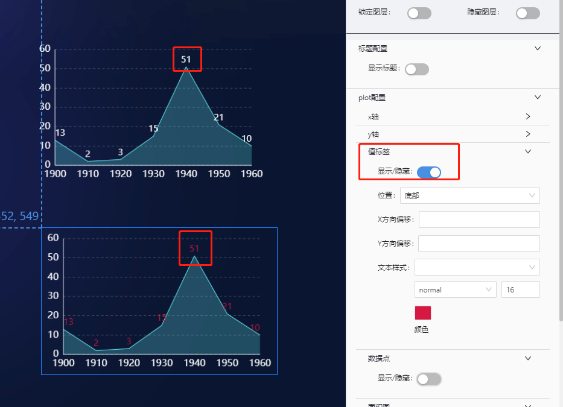

# 基础面积图(base-area) 组件

## 简述

基础面积图(单系列面积)与折线图类似，均可以展示连续性数据，面积图可以更好展示出数据的趋势、累积，减少等变化 ，组件支持图形的 X/Y 轴，提示信息、数据点、面积等样式设置。

## 支持的呈现形式

### 基础柱形图


### X 轴时间类型轴标签格式化


### Y 轴数值格式化


### 值标签设置



### 数据点设置


### 面积图设置


### 悬浮提示设置

 

## 组件逻辑

通过自研的图表组件实现.

## 配置项

## 基础配置

-   坐标轴设置(轴线/刻度线/网格/标签)
-   值标签设置
-   面积图样式设置
-   悬浮提示设置

### 数据

```json
[
    {
        "y": 13, // Y轴数据
        "x": "1900" //X轴数据
    },
    {
        "y": 2,
        "x": "1910"
    },
    {
        "y": 3,
        "x": "1920"
    }
]
```

### 交互

暂无

## 更新说明
