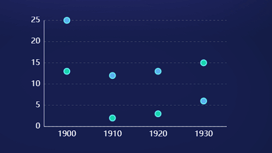
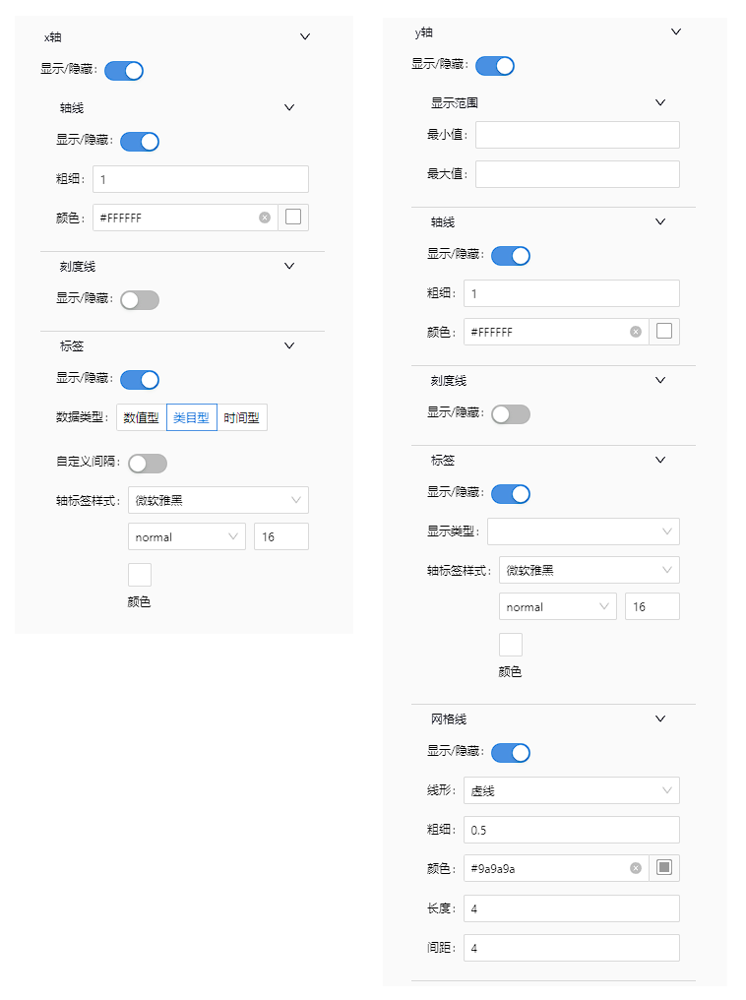
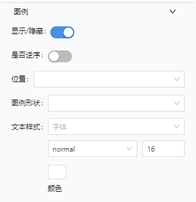
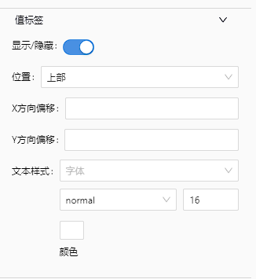
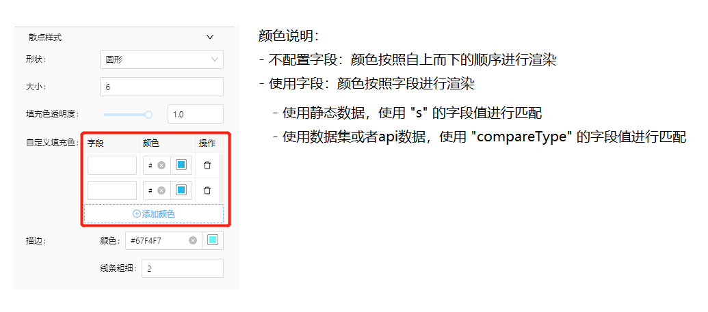
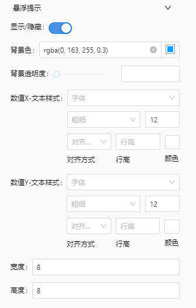

# 基础散点图

## 简述

基础散点图



## 配置项

### 轴线



### 图例



### 值标签



### 散点样式



### 悬浮提示



## 数据模板

```json
{
    "dataModelDefinition": {
        "name": "base-scatter",
        "title": "base-scatter",
        "icon": "",
        "description": "base-scatter",
        "author": "",
        "header": {
            "dimensions": [
                {
                    "dataType": "String",
                    "fieldLabel": "维度名称",
                    "fieldName": "dimension_name",
                    "fieldUnit": "",
                    "list": "true",
                    "rowProperties": ["format"]
                },
                {
                    "dataType": "String",
                    "fieldLabel": "对比维度",
                    "fieldName": "compareType",
                    "fieldUnit": "",
                    "list": "true",
                    "rowProperties": ["format"]
                }
            ],
            "indicators": [
                {
                    "dataType": "String",
                    "fieldLabel": "指标标签",
                    "fieldName": "indicator_label",
                    "fieldUnit": "",
                    "list": "true",
                    "rowProperties": ["format"]
                },
                {
                    "dataType": "String",
                    "fieldLabel": "指标数值",
                    "fieldName": "indicator_value",
                    "fieldUnit": "",
                    "list": "true",
                    "rowProperties": ["format"]
                },
                {
                    "dataType": "String",
                    "fieldLabel": "指标单位",
                    "fieldName": "indicator_unit",
                    "fieldUnit": "",
                    "list": "true",
                    "rowProperties": ["format"]
                }
            ]
        },
        "rowConfig": {
            "dimensionCount": "unknown",
            "isUseDimensionParams": false
        }
    }
}
```

## 特殊说明

<!-- 暂无 -->
