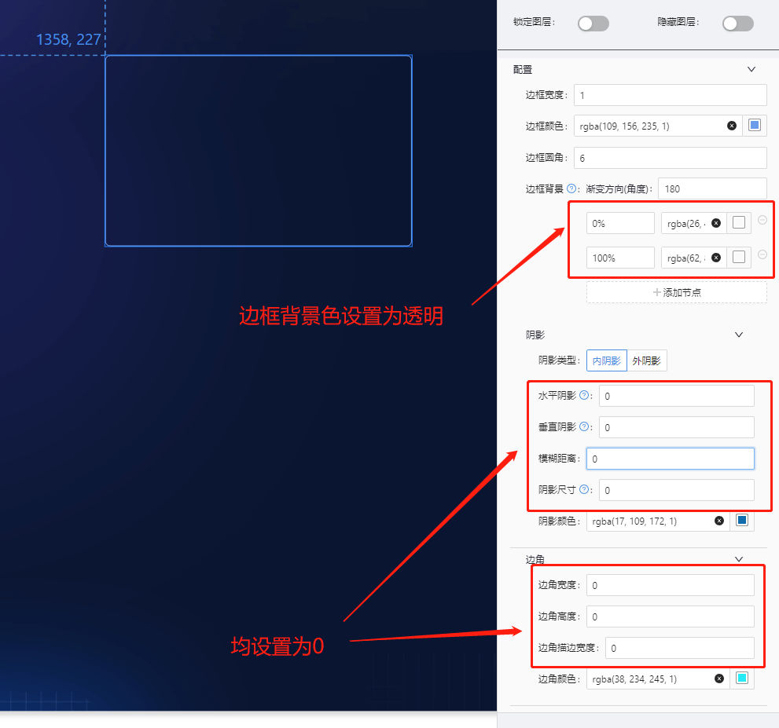
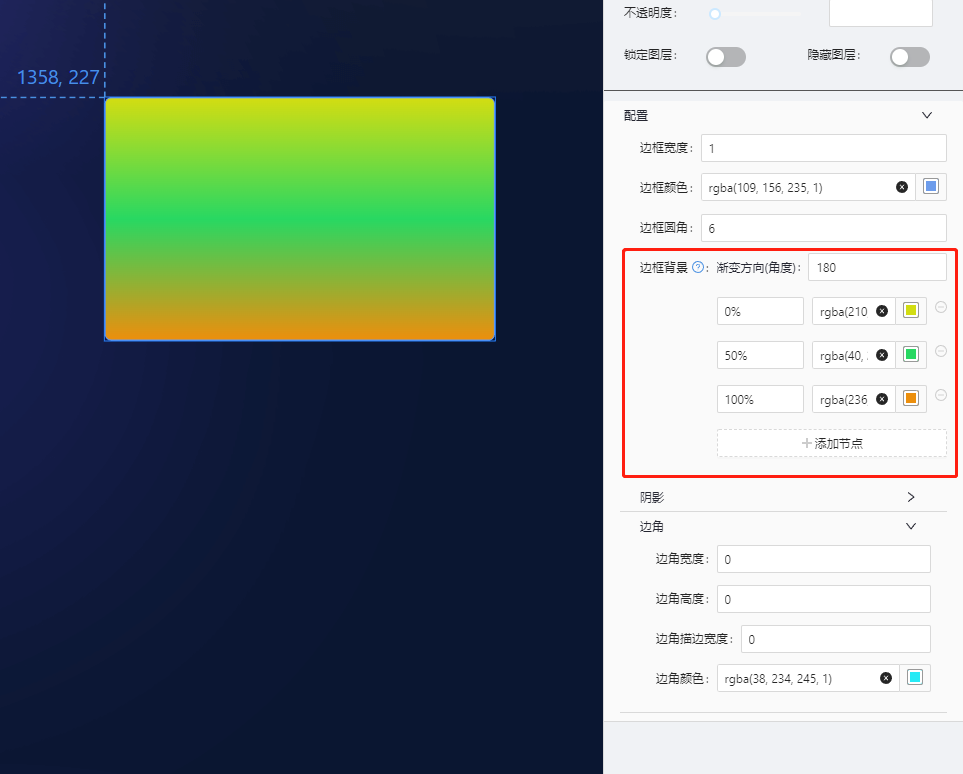
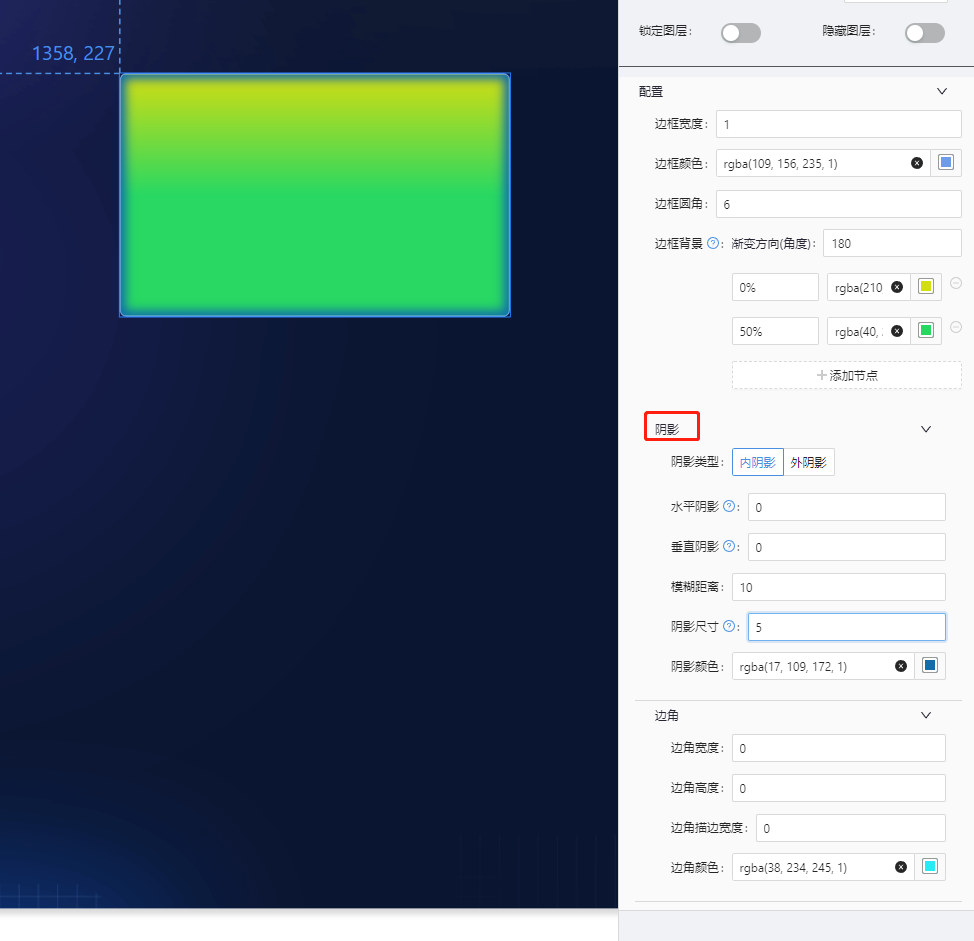
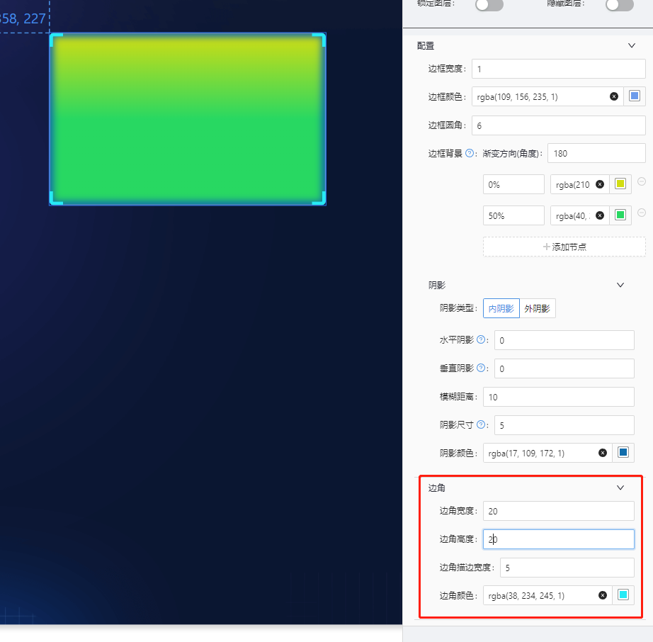

# 边框 10(border10) 组件

## 简述

装饰组件的一种,支持自定义背景块的颜色、边框等，支持为可视化应用或可视化应用的某个模块添加自定义的背景，能够使可视化应用展示更加美观。

## 支持的呈现形式

### 常规边框

### 渐变背景

### 带有边框阴影

### 带有边角的边框

## 组件逻辑

## 配置项

## 基础配置

-   基础边框配置
-   阴影配置
-   边角配置

### 数据

无

### 交互

无

## 更新说明
