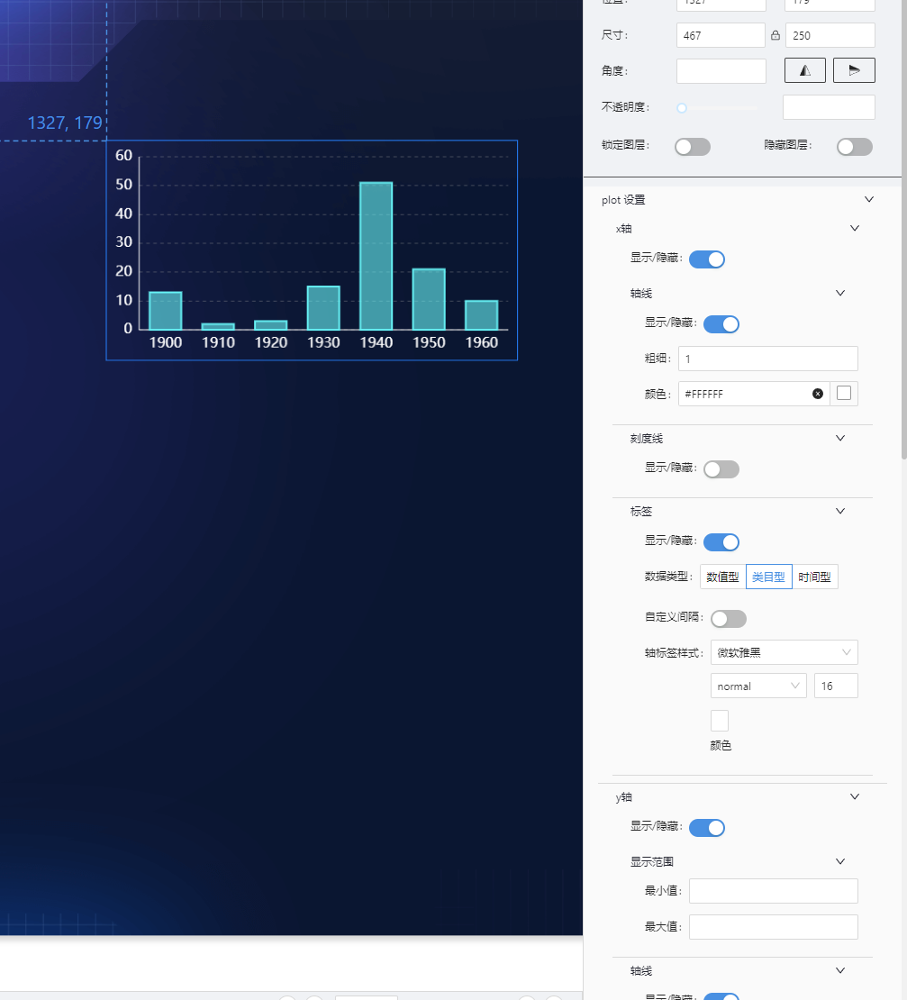
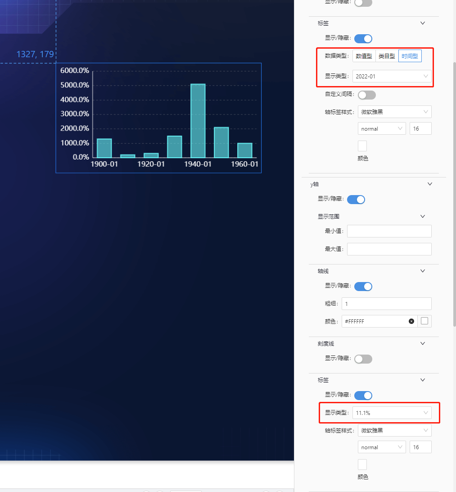
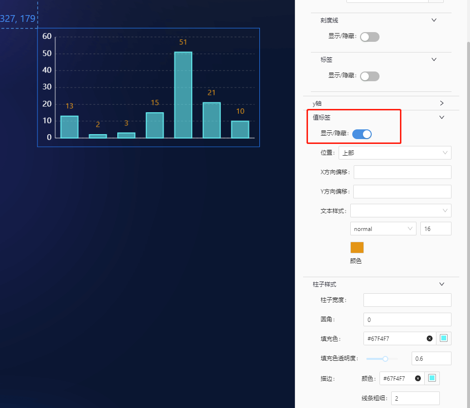
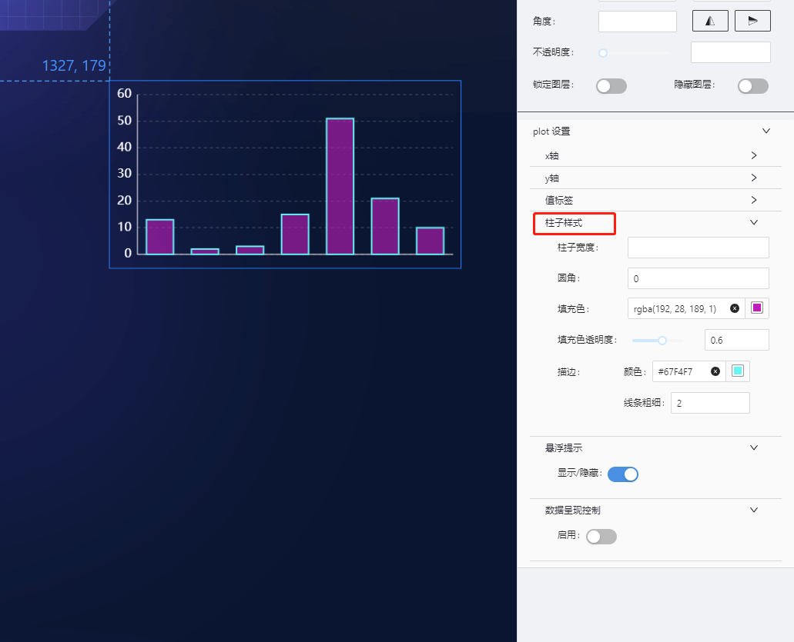
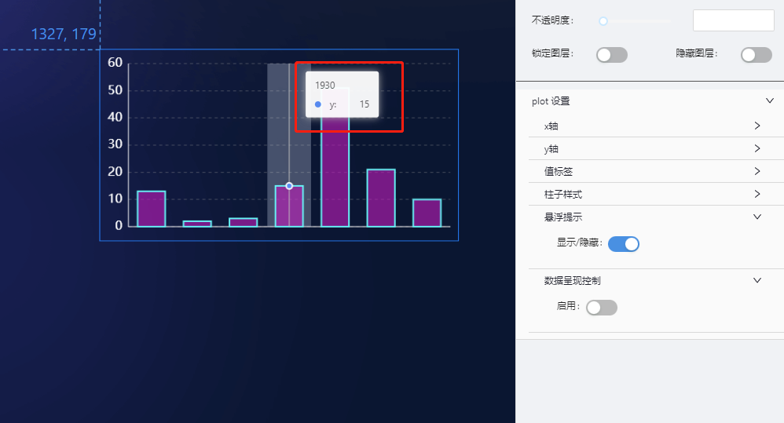
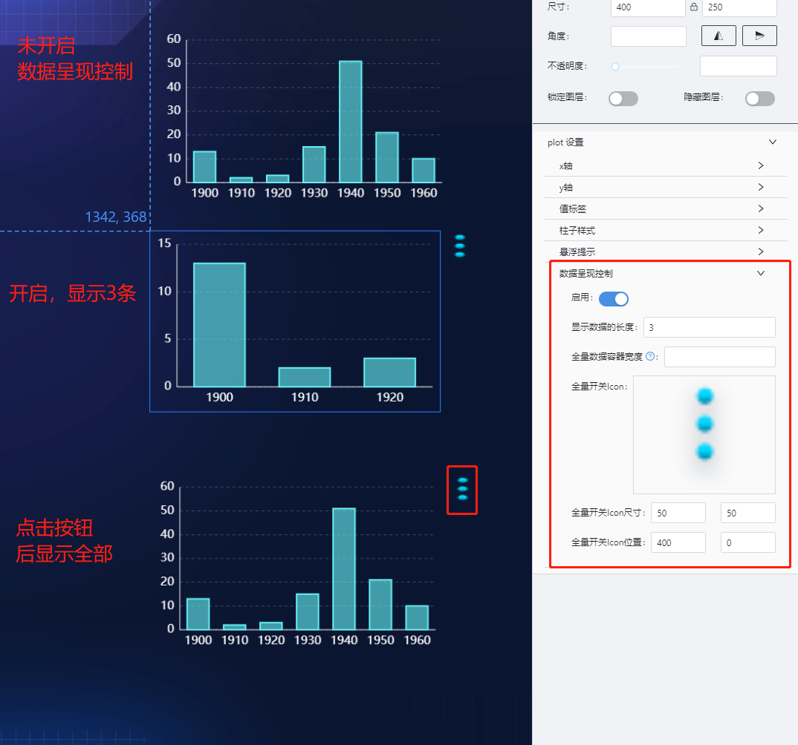
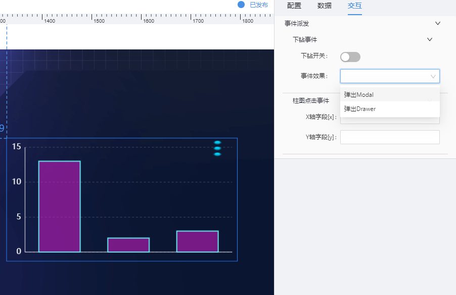

# 基础柱状图(column) 组件

## 简述

基本柱状图(单系列柱形图)是柱状图的一种，支持 X 轴、Y 轴提示信息等配置，能够智能的展示多维数据差异，在可视化应用中，使用频率较高。

## 支持的呈现形式

### 基础柱形图



### 坐标轴格式化



### 值标签设置



### 柱子设置



### 悬浮提示设置



### 数据呈现控制

例如,全量数据共 10 条,但页面显示范围仅可完全展示 3 条,此时可开启该能力,使得页面初始仅展示 3 条数据,点击**全量开关**后,展示全部的 10 条数据.



## 组件逻辑

通过自研的图表组件实现.

## 配置项

## 基础配置

-   坐标轴设置(轴线/刻度线/标签)
-   值标签设置
-   数据点设置
-   柱图图样式设置(暂不支持渐变色)
-   悬浮提示设置
-   数据呈现控制.

### 数据

```json
[
    {
        "y": 13, // Y轴数据
        "x": "1900" //X轴数据
    },
    {
        "y": 2,
        "x": "1910"
    },
    {
        "y": 3,
        "x": "1920"
    }
]
```

### 交互

支持点击图形下钻及事件派发 

-   支持点击图形展示弹框或抽屉
-   支持点击图形时,向外派发数值

    ```js
       示例配置:
       X轴字段[x] : paramX
       Y轴字段[y] : paramY

       数示例数据:
      [
          {
              "y": 13, // Y轴数据
              "x": "1900" //X轴数据
          },
          {
              "y": 2,
              "x": "1910"
          },
          {
              "y": 3,
              "x": "1920"
          }
      ]
      则点击一个柱形图,对外派发的参数为:
      {paramX:"1900",paramY:13}

    ```

## 更新说明

2022-7-15,新增数据呈现控制配置,支持陕西退服专题能力
