# 下钻表格 2

## 简述

下钻表格 2

-   增强型表格
-   支持下钻页面
-   支持`更多`配置
-   点击交互
    -   单元格点击
    -   行点击

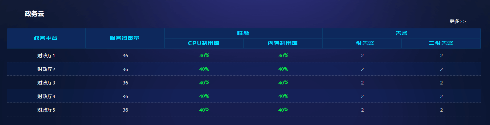

## 配置项

### 样式配置

#### 标题

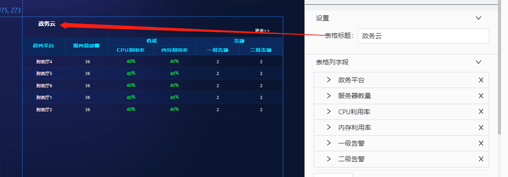

#### 表格列字段

-   自定义每一列字段的样式

    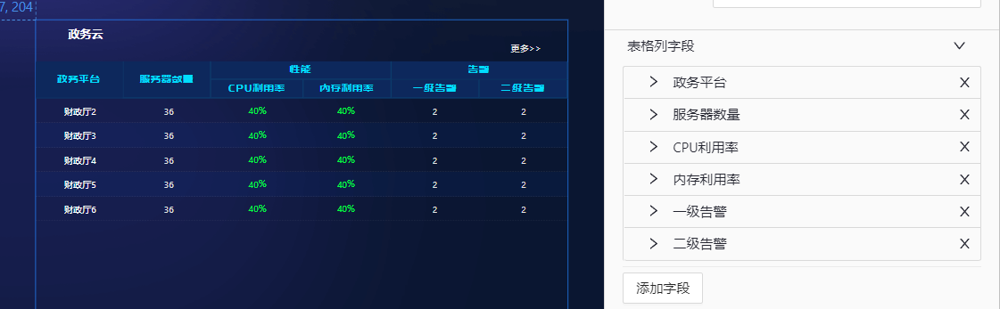

-   列字段详细配置

    -   指定列头名称、字段、表头组等

    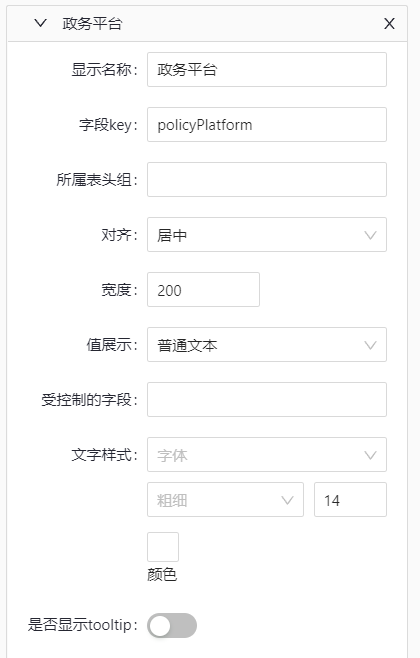

-   每列单元格指定显示样式

    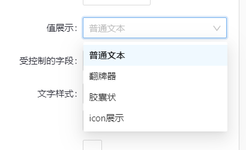

#### 表头组设置

设置需要分组的表头，支持聚合展示

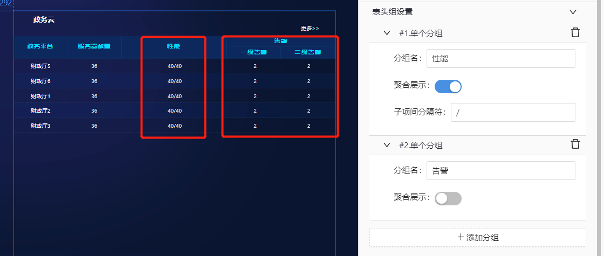

#### 表头设置

主要设置表头样式，包括颜色、粗细、字号等

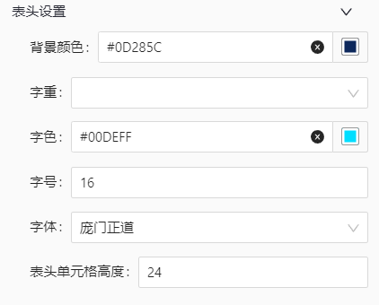

#### 表格行设置

-   支持表格行字段设置
-   样式设置
-   单击效果设置

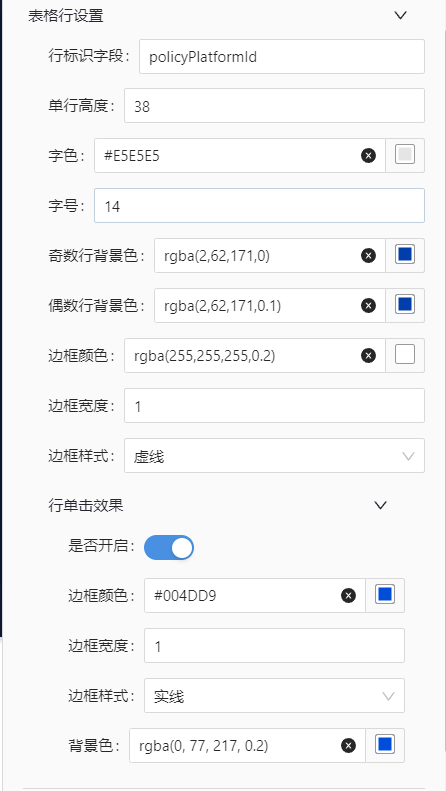

#### 数据轮播设置

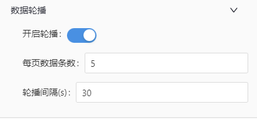

#### ”更多“设置

显示当前表格的全量数据

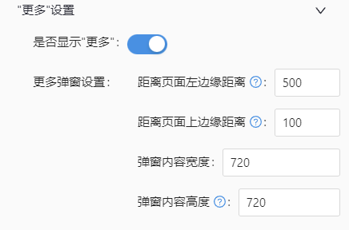

### 数据配置

-   支持 3 种数据源配置：静态数据、API、数据集
-   数据相关配置完成之后，需要点击"刷新数据"才能应用到组件上

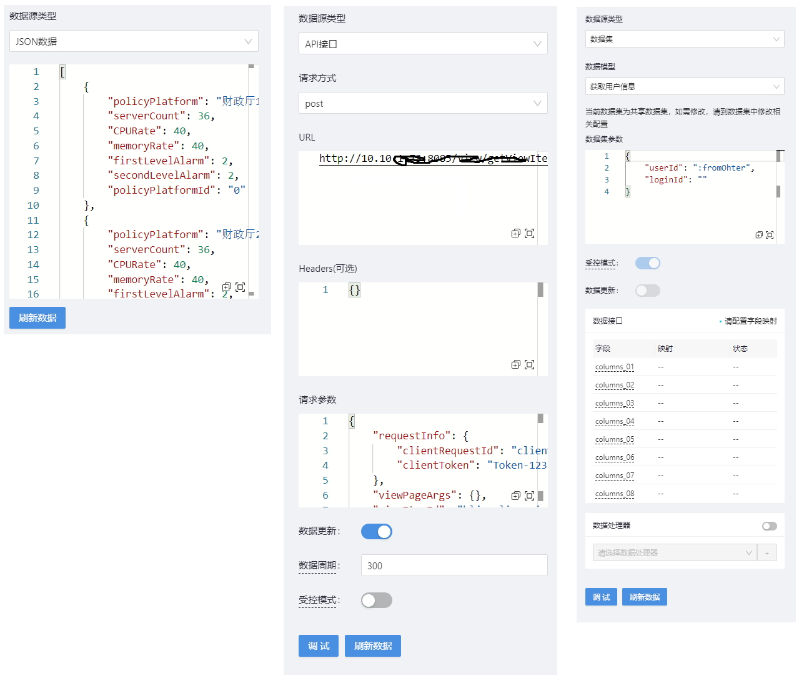

### 交互配置

-   行点击下钻配置

    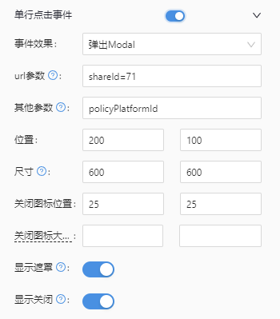

-   事件派发

    -   单元抛出事件

        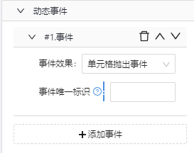

    -   行抛出事件

        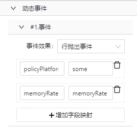

    -   弹出 modal

        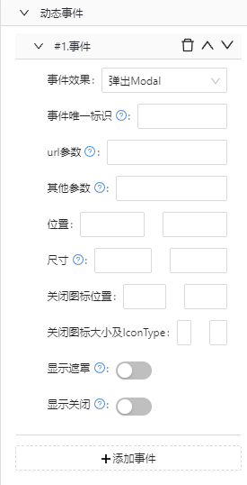

    -   弹出 Drawer

        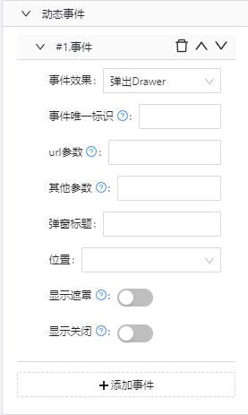

## 数据模板

列数据自由拓展

```json
{
    "dataModelDefinition": {
        "name": "drilldown-table-2",
        "title": "drilldown-table-2",
        "icon": "",
        "description": "drilldown-table-2，下钻表格2",
        "author": "闫志峰",
        "page": true,
        "header": {
            "dimensions": [],
            "indicators": [
                {
                    "dataType": "String",
                    "fieldLabel": "列1",
                    "fieldName": "columns_01",
                    "fieldUnit": "",
                    "list": "true",
                    "rowProperties": ["format"]
                },
                {
                    "dataType": "String",
                    "fieldLabel": "列2",
                    "fieldName": "columns_02",
                    "fieldUnit": "",
                    "list": "true",
                    "rowProperties": ["format"]
                },
                ...
                 {
                    "dataType": "String",
                    "fieldLabel": "列n",
                    "fieldName": "columns_n",
                    "fieldUnit": "",
                    "list": "true",
                    "rowProperties": ["format"]
                },
            ]
        },
        "rowConfig": {
            "dimensionCount": "unknown",
            "isUseDimensionParams": false
        }
    }
}
```

## 特殊说明

暂无
