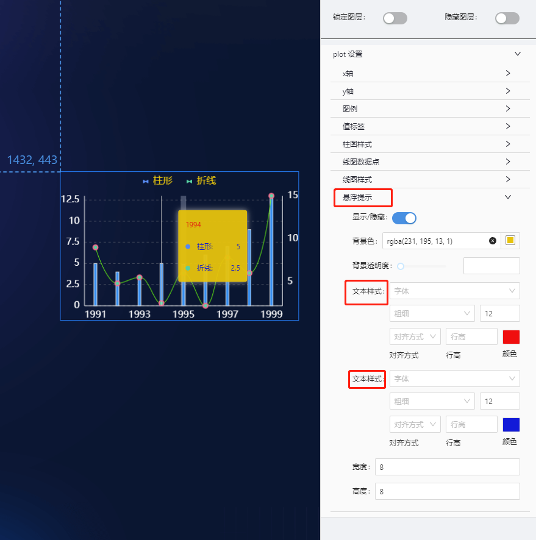

# 基础双轴(dual-axes) 组件

## 简述

双轴图是指有多个(≥2)Y 轴的数据图表,多为柱状图+折线图的结合,图表显示更为直观。除了适合分析两个相差较大的数据,双轴图也适用于不同数据走势、数据同环比分析等场景。

当前组件为单系列柱图+单系列折线图,支持两个 Y 轴.

## 支持的呈现形式

### 基础柱形图


### 坐标轴标签格式化


### 图例设置


### 值标签设置


### 图形设置


### 悬浮提示设置



## 组件逻辑

通过自研的图表组件实现.

## 配置项

## 基础配置

-   坐标轴设置(轴线/刻度线/网格/标签)
-   值标签设置
-   图例设置
-   图形设置(柱图/线图/数据点)
-   悬浮提示设置

### 数据

```json
[
    {
        "x": "1991",
        "y": 5,
        "s": "柱形"
    },
    {
        "x": "1992",
        "y": 4,
        "s": "柱形"
    },
    {
        "x": "1993",
        "y": 3.5,
        "s": "柱形"
    },
    {
        "x": "1994",
        "y": 5,
        "s": "柱形"
    },
    {
        "x": "1995",
        "y": 4.9,
        "s": "柱形"
    },
    {
        "x": "1996",
        "y": 6,
        "s": "柱形"
    },
    {
        "x": "1997",
        "y": 7,
        "s": "柱形"
    },
    {
        "x": "1998",
        "y": 9,
        "s": "柱形"
    },
    {
        "x": "1999",
        "y": 13,
        "s": "柱形"
    },
    {
        "x": "1991",
        "y": 9,
        "s": "折线"
    },
    {
        "x": "1992",
        "y": 4.8,
        "s": "折线"
    },
    {
        "x": "1993",
        "y": 5.5,
        "s": "折线"
    },
    {
        "x": "1994",
        "y": 2.5,
        "s": "折线"
    },
    {
        "x": "1995",
        "y": 6,
        "s": "折线"
    },
    {
        "x": "1996",
        "y": 2.2,
        "s": "折线"
    },
    {
        "x": "1997",
        "y": 7.8,
        "s": "折线"
    },
    {
        "x": "1998",
        "y": 6,
        "s": "折线"
    },
    {
        "x": "1999",
        "y": 15,
        "s": "折线"
    }
]
```

### 交互

支持点击图形下钻及事件派发 

-   支持点击图形展示弹框或抽屉
-   支持点击柱形图时,向外派发数值

    ```js
       示例配置:
       X轴字段[x] : paramX
       Y轴字段[y] : paramY

       数示例数据:
      [
        {
            "x": "1991",
            "y": 5,
            "s": "柱形"
        },
        {
            "x": "1991",
            "y": 6,
            "s": "折线"
        },
      ]
      则点击一个柱形图,对外派发的参数为:
      {paramX:"1991",paramY:5}

    ```

## 更新说明
