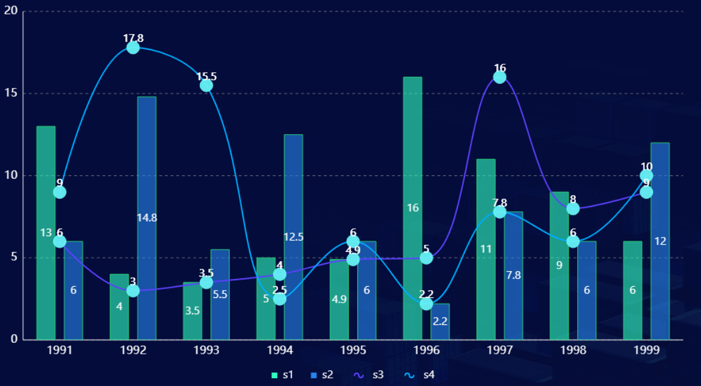
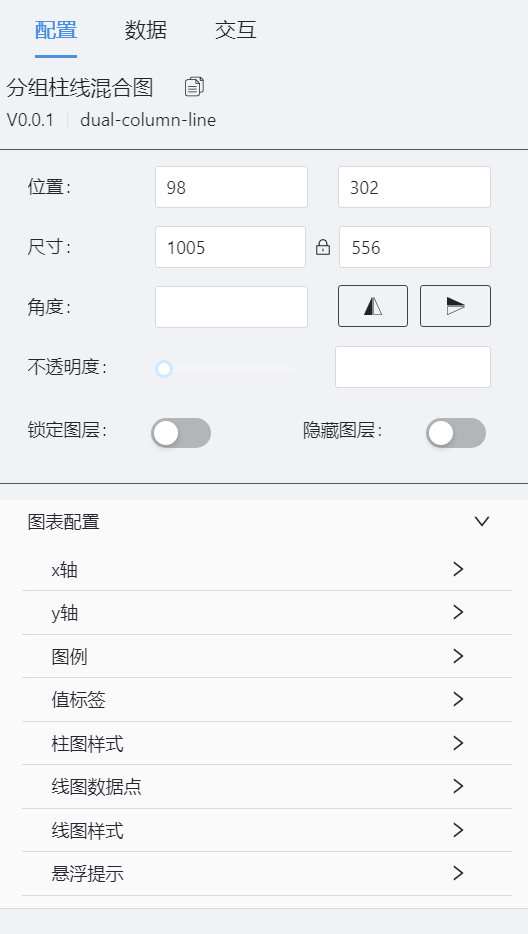
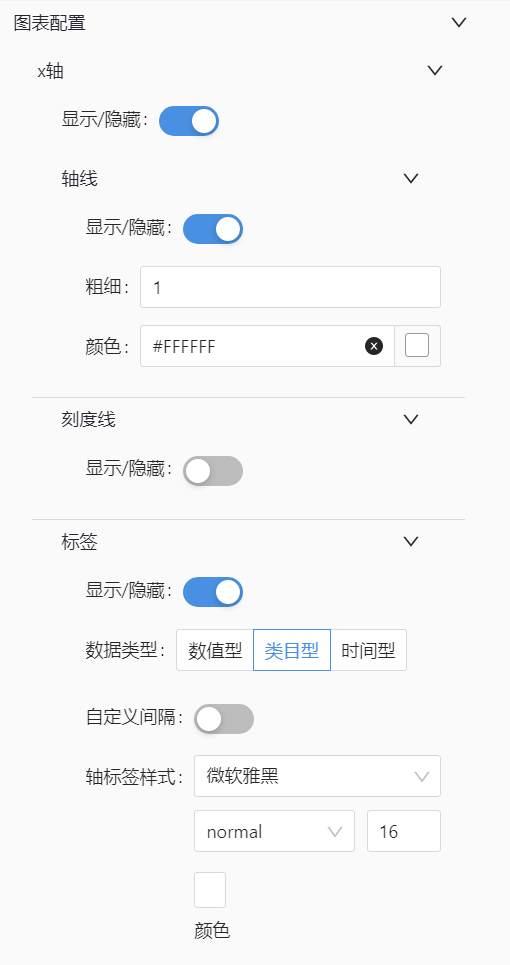
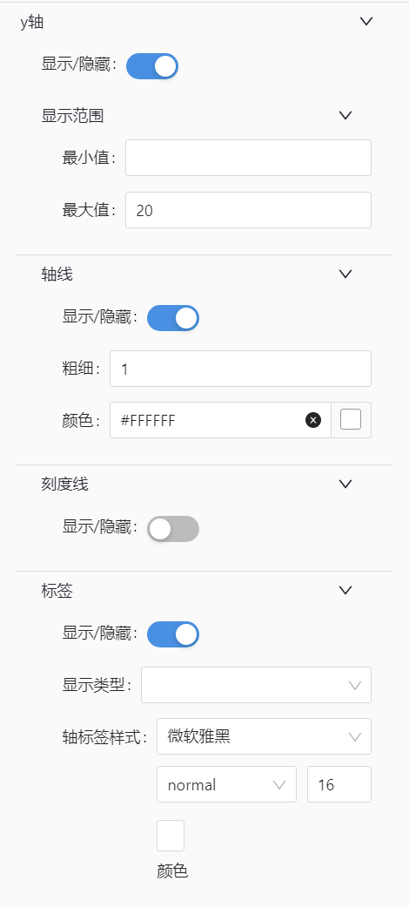
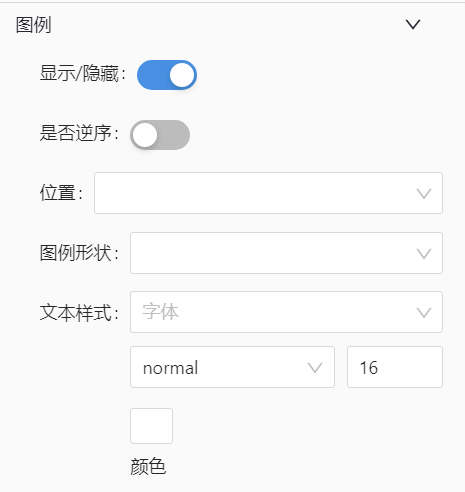
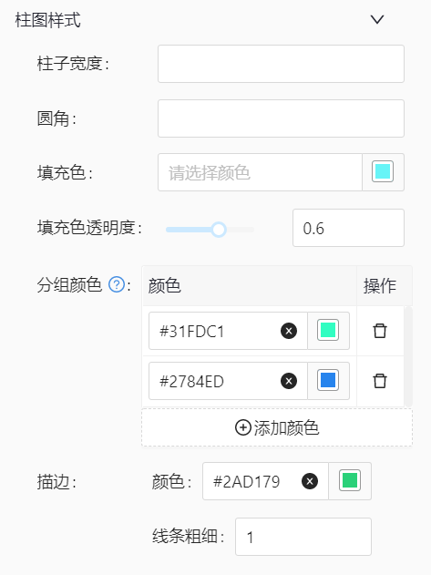
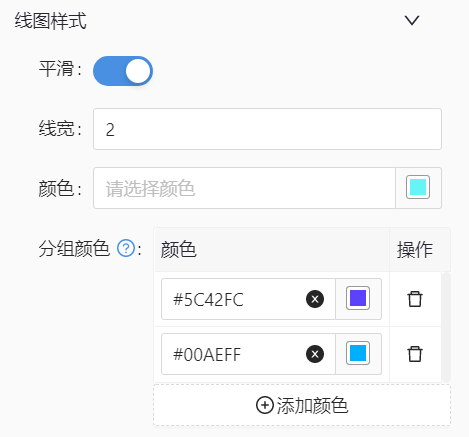
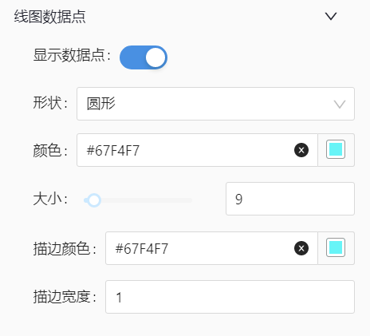
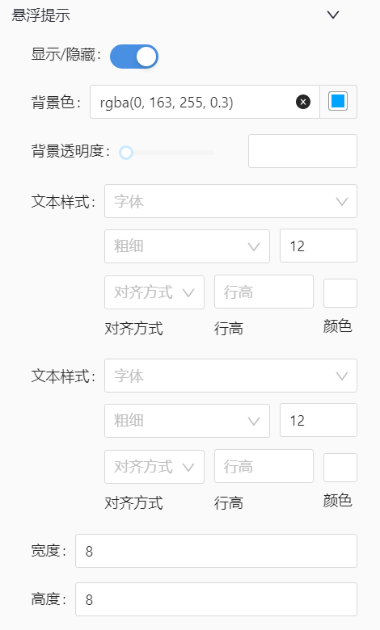

# 分组柱线混合图(dual-column-line) 组件

## 简述

分组柱线混合图实现多系列柱图与折线图联合展示效果

## 支持的呈现形式

### 显示效果



### 参数值配置



### 坐标轴配置





### 图例配置



### 值标签配置


### 图形配置







### 悬浮提示配置



### 数据

-   坐标轴 x、y
-   分类 s
-   图表类型 t：1 柱图、2 线图

```json
[
    {
        "x": "1991",
        "y": 13,
        "s": "s1",
        "t": 1
    },
    {
        "x": "1992",
        "y": 4,
        "s": "s1",
        "t": 1
    },
    {
        "x": "1993",
        "y": 3.5,
        "s": "s1",
        "t": 1
    },
    {
        "x": "1994",
        "y": 5,
        "s": "s1",
        "t": 1
    },
    {
        "x": "1995",
        "y": 4.9,
        "s": "s1",
        "t": 1
    },
    {
        "x": "1996",
        "y": 16,
        "s": "s1",
        "t": 1
    },
    {
        "x": "1997",
        "y": 11,
        "s": "s1",
        "t": 1
    },
    {
        "x": "1998",
        "y": 9,
        "s": "s1",
        "t": 1
    },
    {
        "x": "1999",
        "y": 6,
        "s": "s1",
        "t": 1
    },
    {
        "x": "1991",
        "y": 6,
        "s": "s2",
        "t": 1
    },
    {
        "x": "1992",
        "y": 14.8,
        "s": "s2",
        "t": 1
    },
    {
        "x": "1993",
        "y": 5.5,
        "s": "s2",
        "t": 1
    },
    {
        "x": "1994",
        "y": 12.5,
        "s": "s2",
        "t": 1
    },
    {
        "x": "1995",
        "y": 6,
        "s": "s2",
        "t": 1
    },
    {
        "x": "1996",
        "y": 2.2,
        "s": "s2",
        "t": 1
    },
    {
        "x": "1997",
        "y": 7.8,
        "s": "s2",
        "t": 1
    },
    {
        "x": "1998",
        "y": 6,
        "s": "s2",
        "t": 1
    },
    {
        "x": "1999",
        "y": 12,
        "s": "s2",
        "t": 1
    },
    {
        "x": "1991",
        "y": 6,
        "s": "s3",
        "t": 2
    },
    {
        "x": "1992",
        "y": 3,
        "s": "s3",
        "t": 2
    },
    {
        "x": "1993",
        "y": 3.5,
        "s": "s3",
        "t": 2
    },
    {
        "x": "1994",
        "y": 4,
        "s": "s3",
        "t": 2
    },
    {
        "x": "1995",
        "y": 4.9,
        "s": "s3",
        "t": 2
    },
    {
        "x": "1996",
        "y": 5,
        "s": "s3",
        "t": 2
    },
    {
        "x": "1997",
        "y": 16,
        "s": "s3",
        "t": 2
    },
    {
        "x": "1998",
        "y": 8,
        "s": "s3",
        "t": 2
    },
    {
        "x": "1999",
        "y": 9,
        "s": "s3",
        "t": 2
    },
    {
        "x": "1991",
        "y": 9,
        "s": "s4",
        "t": 2
    },
    {
        "x": "1992",
        "y": 17.8,
        "s": "s4",
        "t": 2
    },
    {
        "x": "1993",
        "y": 15.5,
        "s": "s4",
        "t": 2
    },
    {
        "x": "1994",
        "y": 2.5,
        "s": "s4",
        "t": 2
    },
    {
        "x": "1995",
        "y": 6,
        "s": "s4",
        "t": 2
    },
    {
        "x": "1996",
        "y": 2.2,
        "s": "s4",
        "t": 2
    },
    {
        "x": "1997",
        "y": 7.8,
        "s": "s4",
        "t": 2
    },
    {
        "x": "1998",
        "y": 6,
        "s": "s4",
        "t": 2
    },
    {
        "x": "1999",
        "y": 10,
        "s": "s4",
        "t": 2
    }
]
```

### 交互配置

支持点击图形下钻及事件派发


-   支持点击图形展示弹框或抽屉
-   支持点击图形时,向外派发数值

    ```js
       示例配置:
       X轴字段[x] : paramX
       Y轴字段[y] : paramY
       Y轴字段[s] : paramS

       示例数据:
      [
        {
            "x": "1991",
            "y": 13,
            "s": "s1",
            "t": 1
        },
        {
            "x": "1992",
            "y": 17.8,
            "s": "s4",
            "t": 2
        }
      ]

      点击柱图,对外派发的参数为:
      {paramX:"1991",paramY:13,paramS:"s1"}

      点击线图,对外派发的参数为:
      {paramX:"1992",paramY:17.8,paramS:"s4"}

    ```
