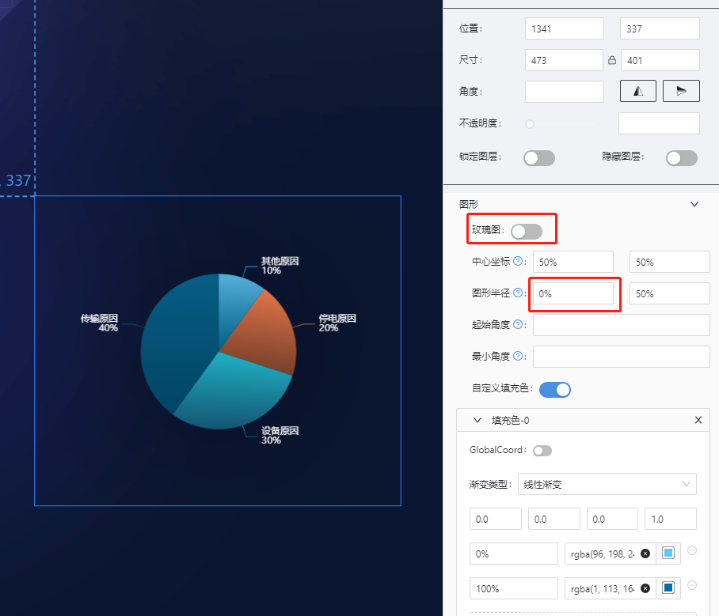
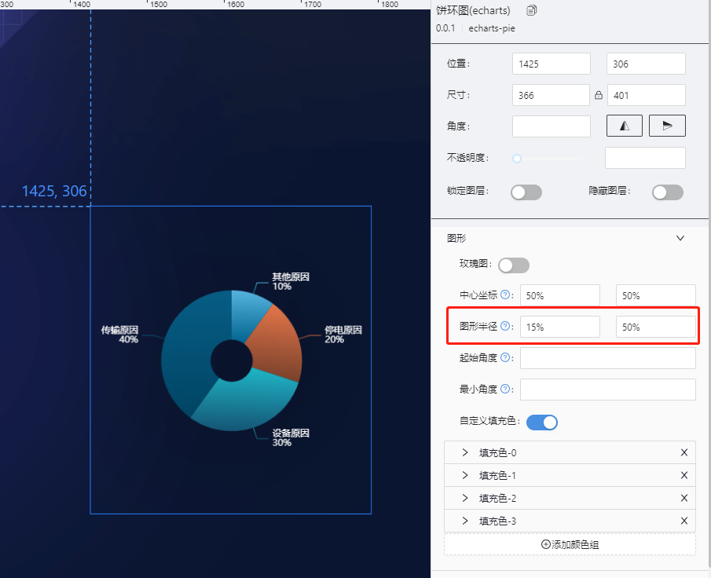
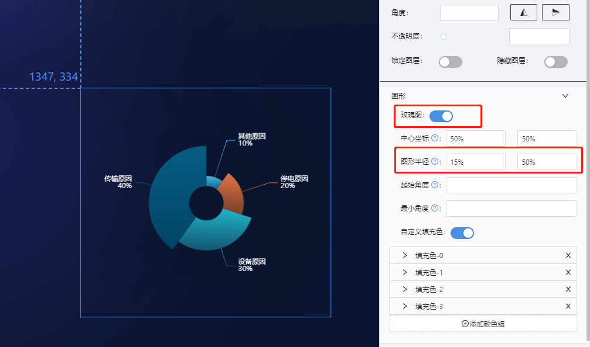
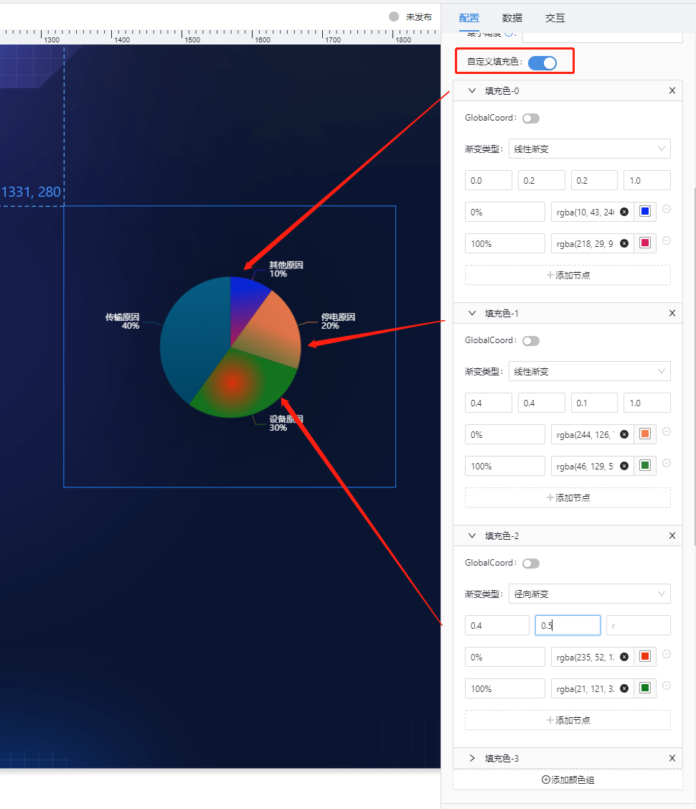
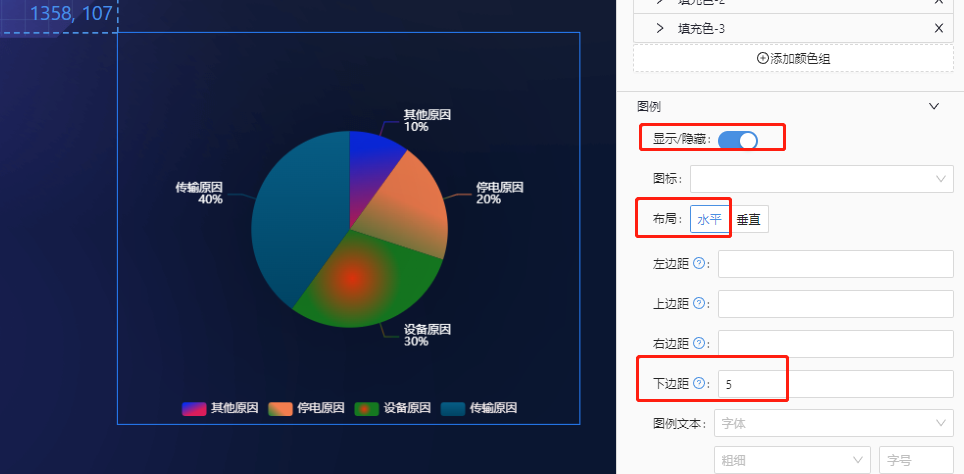
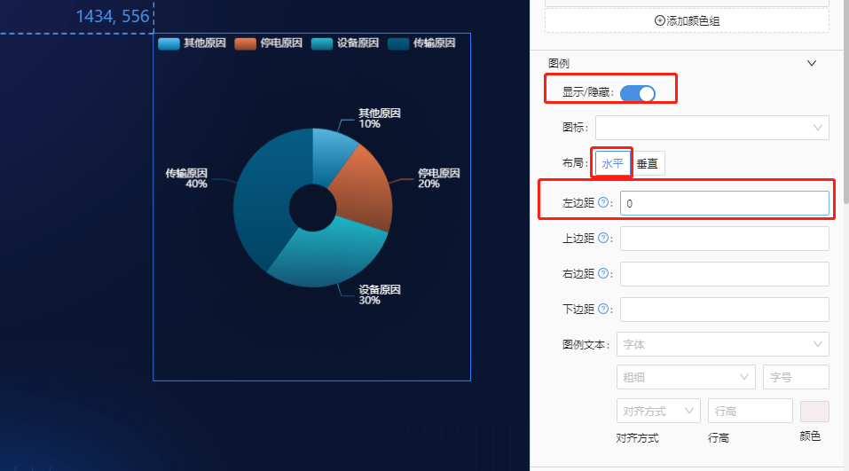
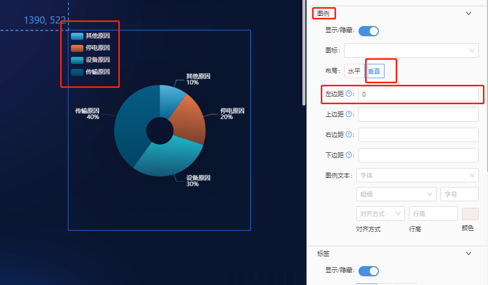
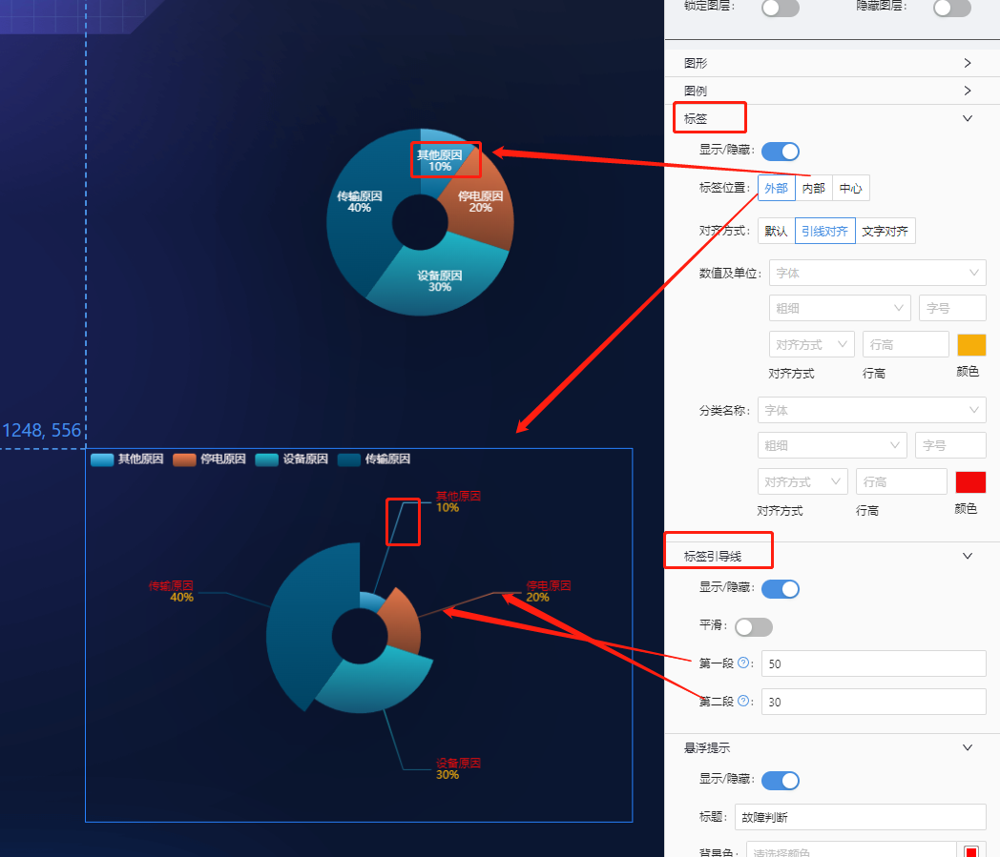
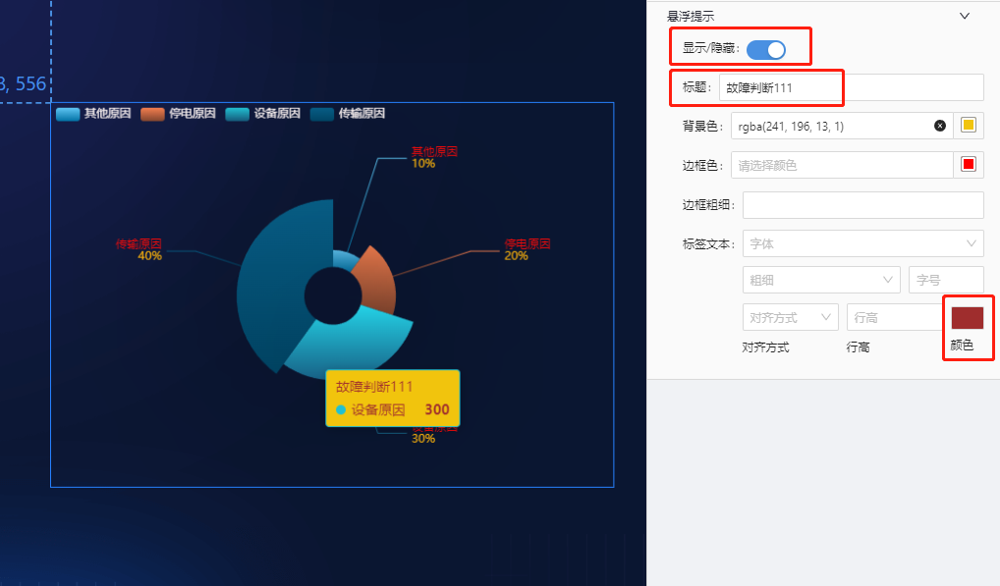
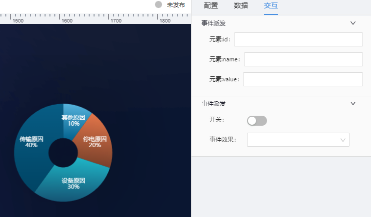

# 基础饼图(echarts-pie) 组件

## 简述

组件支持设置为饼图/环图/玫瑰图.

设计指引:

-   饼图:通过扇形区块的面积，弧度和颜色等视觉标记，展现数据的分类和占比情况。它的特点是展现部分与部分之间，以及部分与整体的关系。部分相加之和等于整体的 100%，用整圆表示。
-   环图（甜甜圈图）

    其本质是饼图将中间区域挖空,虽然如此，环图还是有它一点微小的优点。饼图的整体性太强，我们会将注意力集中在比较饼图内各个扇形之间占整体比重的关系。但如果我们将两个饼图放在一起，饼图很难同时对比两个图。

    环图在解决上述问题时，采用了让我们更关注长度而不是面积的做法。这样我们就能相对简单的对比不同的环图。

    同时环图相对于饼图空间的利用率更高，比如我们可以使用它的空心区域显示文本信息，比如标题等。

-   玫瑰图:是在极坐标下绘制的柱状图，使用圆弧的半径长短表示数据的大小（数量的多少）。

    -   由于半径和面积的关系是平方的关系，玫瑰图会将数据的比例大小夸大，尤其适合对比大小相近的数值。

    -   由于圆形有周期的特性，所以玫瑰图也适用于表示一个周期内的时间概念，比如星期、月份。

## 支持的呈现形式

### 基础柱形图

#### 饼图



#### 环图



#### 玫瑰图



### 图形颜色设置



### 图例设置

#### 水平图例

 

#### 垂直图例



### 标签及引线



### 悬浮提示设置



### 数据呈现控制

例如,全量数据共 10 条,但页面显示范围仅可完全展示 3 条,此时可开启该能力,使得页面初始仅展示 3 条数据,点击**全量开关**后,展示全部的 10 条数据.


## 组件逻辑

通过自研的图表组件实现.

## 配置项

## 基础配置

-   图形
-   标签及引线设置
-   图例设置
-   悬浮提示

### 数据

```json
[
    {
        "name": "其他原因", //分类
        "value": 100, //数值
        "unit": "个", ///单位
        "id": "" //指标ID，主要做为点击参数使用
    },
    {
        "name": "停电原因",
        "value": 200,
        "unit": "个",
        "id": ""
    }
]
```

### 交互

支持点击图形下钻及事件派发



-   支持点击图形展示弹框或抽屉
-   支持点击图形时,向外派发数值
-   参数派发及事件派发互斥

    ```js
       示例配置:
       元素:id : paramId
       元素:name : paramName
       元素:value :paramValue

       数示例数据:
      [
         {
            "name": "其他原因", //分类
            "value": 100, //数值
            "unit": "个", ///单位
            "id": "1" //指标ID，主要做为点击参数使用
        },
        {
            "name": "停电原因",
            "value": 200,
            "unit": "个",
            "id": ""
        }
      ]
      则点击一个分类,对外派发的参数为:
      {paramId:"1",paramName:'其他原因',paramValue:100}

    ```

## 更新说明

2022-7-15,新增标签及图例文本样式设置
