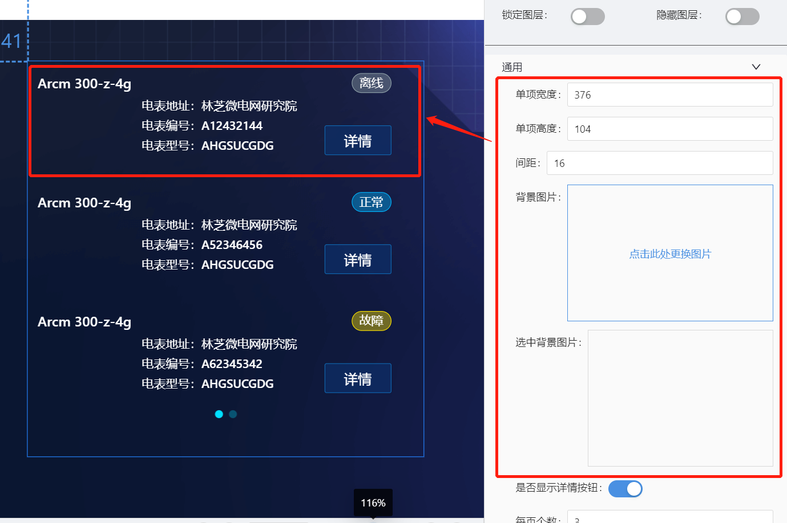
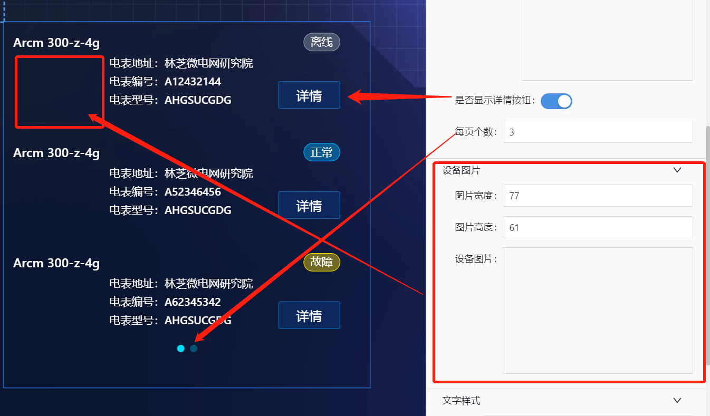
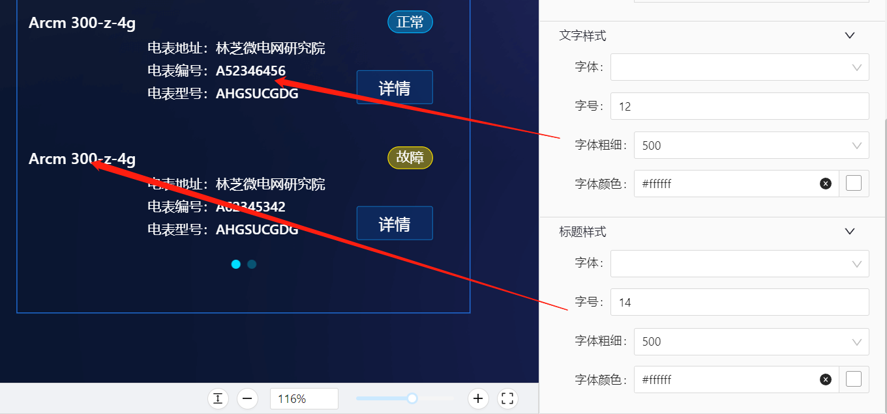

# 电表信息(equip-list) 组件

## 简述

-   用于大屏电表信息的显示.
-   支持点击参数派发
-   支持点击后的弹框/抽屉事件配置

## 配置项

## 基础配置

-   单项样式的配置
-   背景图片和设备图片的配置
-   是否显示详情的配置
-   每页显示个数的配置

  

### 数据

```json
[
    {
        "name": "Arcm 300-z-4g",
        "statusName": "离线",
        "status": "2",
        "address": "林芝微电网研究院",
        "number": "A12432144",
        "modelNum": "AHGSUCGDG"
    }
]
```

### 交互

支持设置点击单项后传参和点击事件(弹窗 or 抽屉).
