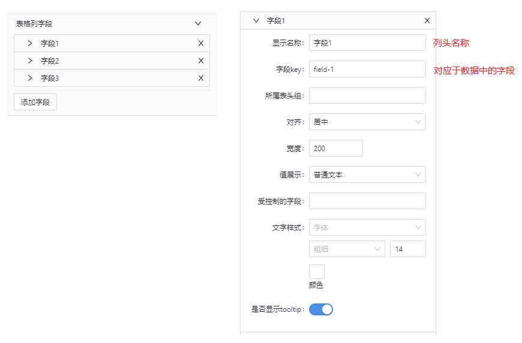
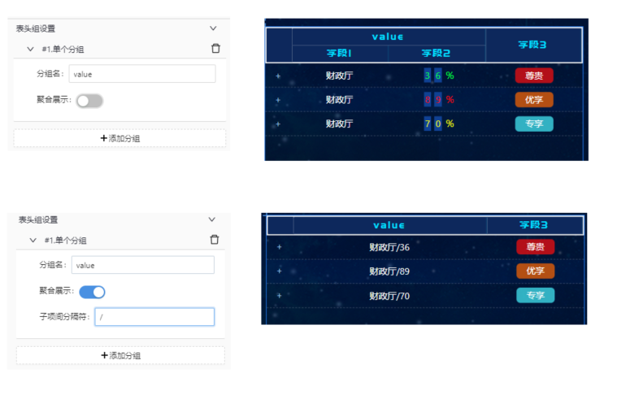
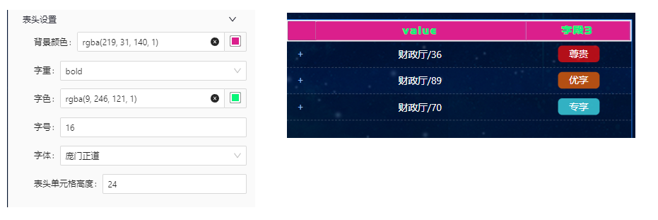
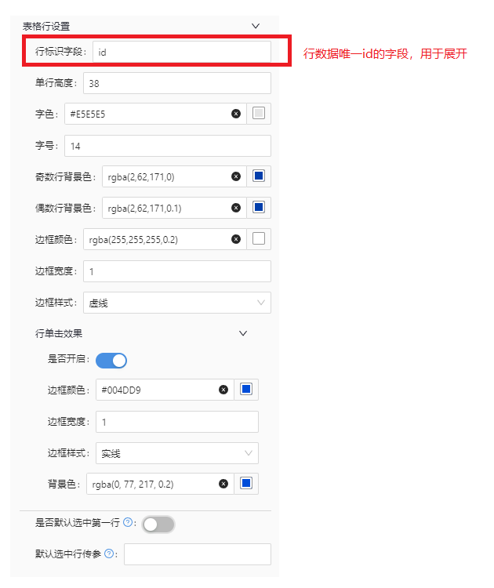
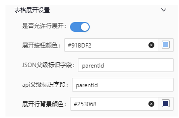

# 下挂表格

## 简述

子表格

> 当表格内容较多不能一次性完全展示时。

demo 如下：


## 配置项

### 表格列字段

-   列配置，用来配置每一列的显示
-   可以通过下面的**添加字段**来增加字段配置



### 表头组设置

-   配置表头聚合的效果

    

### 表头设置



### 表格行设置

-   需要注意 **行标识字段** 的配置



### 表格展开设置

-   重点说明：

    -   **JSON 父级标识字段**

        -   组件内部会根据这个字段挂接数据

    -   **api 父级标识字段**

        -   展开时请求数据需要字段

            ```js
            // 定义的api父级标识字段
            const field = 'parentId';
            const parentId = 1;

            // 示例
            api.post('//getViewItemData', {
                [field]: parentId,
            });
            ```



## 数据模板

```json
{
    "dataModelDefinition": {
        "name": "expandable-table",
        "title": "expandable-table",
        "icon": "",
        "description": "可展开子级的表格",
        "author": "刘贤良",
        "header": {
            "dimensions": [],
            "indicators": [
                // 父级id，有挂接关系就应该有，如果没有挂接关系，可以为空
                {
                    "dataType": "String",
                    "fieldLabel": "父级ID,唯一",
                    "fieldName": "parentId",
                    "fieldUnit": "",
                    "list": "true",
                    "rowProperties": ["format"]
                },
                // 必须有
                {
                    "dataType": "String",
                    "fieldLabel": "行ID,唯一",
                    "fieldName": "id",
                    "fieldUnit": "",
                    "list": "true",
                    "rowProperties": ["format"]
                },
                // 下面的字段可以根据业务自行扩展
                {
                    "dataType": "String",
                    "fieldLabel": "表格列",
                    "fieldName": "field-N",
                    "fieldUnit": "",
                    "list": "true",
                    "rowProperties": ["format"]
                }
            ]
        },
        "rowConfig": {
            "dimensionCount": "unknown",
            "isUseDimensionParams": false
        }
    }
}
```

## 特殊说明

需要注意的配置

-   列配置的字段配置： **列字段 key**
-   表格行配置： **行标识字段**
-   表格展开设置： **JSON 父级标识字段** 、**api 父级标识字段**
