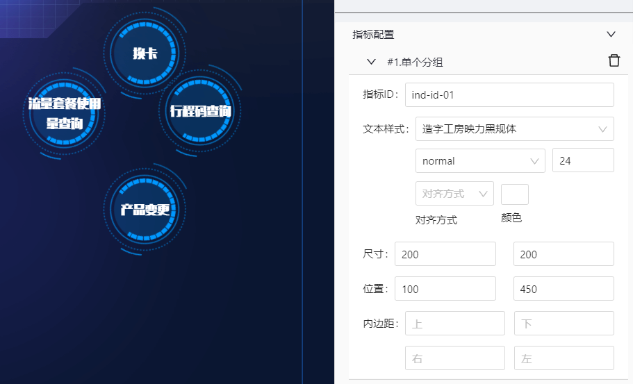
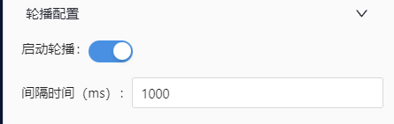
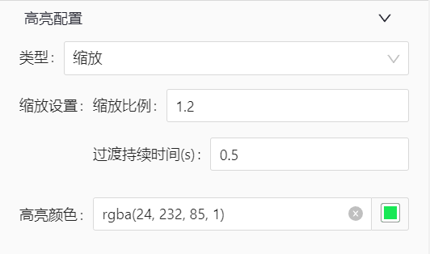

# 自由排布指标组

## 简述

可以自由布局的指标组

-   支持手动配置各个指标的位置
-   轮播到的组件，突出显示
-   鼠标移入到指标，整体轮播停止，鼠标点击，向外派发参数

## 配置项

> 渲染指标的个数与指标配置是一致的

### 单个指标配置

-   指标配置
    -   需要指定指标的 id，用来与数据匹配
    -   支持配置指标的文本样式，尺寸，位置（位置基于左上角进行摆放）
    -   支持指标内边距配置
-   点击按钮增加指标配置



### 轮播配置

-   支持启停轮播
-   支持轮播间隔时间设置



### 高亮配置

-   支持类型：缩放
-   缩放
    -   缩放比例配置
    -   过渡动画持续时间配置
    -   颜色配置



### 鼠标移出配置

-   鼠标移出后是否取消高亮


## 数据模板

```json
{
    "dataModelDefinition": {
        "name": "free-layout-indicator-group",
        "title": "free-layout-indicator-group",
        "icon": "",
        "description": "",
        "author": "",
        "header": {
            "dimensions": [],
            "indicators": [
                {
                    "dataType": "String",
                    "fieldLabel": "指标名称",
                    "fieldName": "indicatorName",
                    "fieldUnit": "",
                    "list": "true",
                    "rowProperties": ["format"]
                },
                {
                    "dataType": "String",
                    "fieldLabel": "指标id",
                    "fieldName": "indicatorId",
                    "fieldUnit": "",
                    "list": "true",
                    "rowProperties": ["format"]
                },
                {
                    "dataType": "String",
                    "fieldLabel": "指标等级",
                    "fieldName": "indicatorLevel", // 用来控制指标等级的颜色
                    "fieldUnit": "",
                    "list": "true",
                    "rowProperties": ["format"]
                }
            ]
        },
        "rowConfig": {
            "dimensionCount": "unknown",
            "isUseDimensionParams": false
        }
    }
}
```

## 交互

### 派发参数

-   点击派发
-   轮播自动派发
-   支持派发的参数：指标名称、指标 ID


## 特殊说明

（无）
