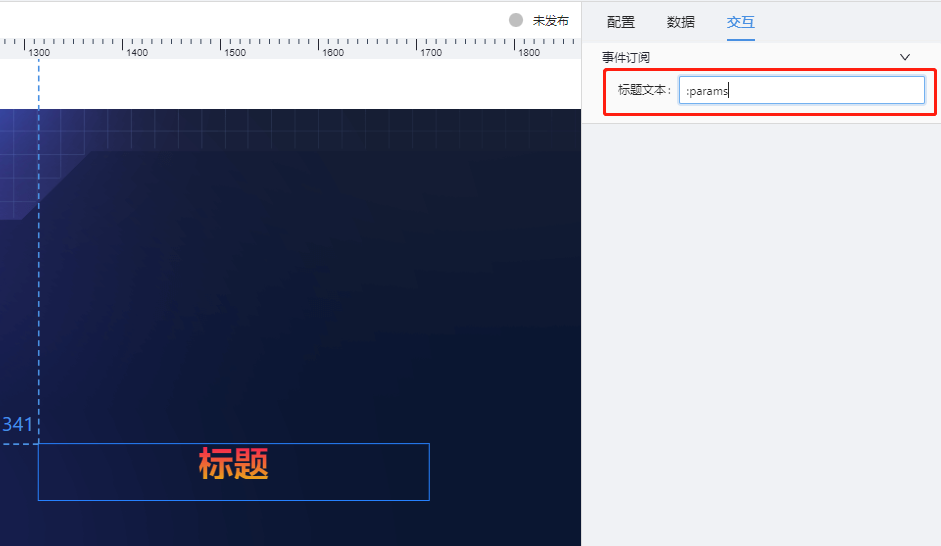

# 标题(label-text) 组件

## 简述

通用标题是文字组件的一种，支持自定义标题的内容、位置、颜色等，支持在可视化应用中添加多个通用标题组件，展示可视化应用和可视化应用中各个模块的标题。目前支持的字体

```js
微软雅黑,
宋体,
黑体,
思源黑体,
Verdana,
TRENDS,
DIGIFACEWIDE,
AGENCYB,
AGENCYR,
Pixel LCD-7,
方正综艺简体,
Adobe 黑体 Std R,
时尚中黑简体,
方正综艺,
思源黑体-Medium,
庞门正道 ,
励字粗圆简繁,
```

## 支持的呈现形式

### 常规


### 背景渐变标题


### 文字渐变标题


### 带倒影的标题


### 带前缀图标的标题


### 有边框的的标题


### 有边框的的标题


### 支持标题说明


## 配置项

## 基础配置

-   支持内容文本配置
-   支持标题字体配置
-   支持标题背景及前缀图的配置
-   支持鼠标焦点到标题后的 tooltip 提示配置

### 数据

组件的数据,目前不建议配置.

### 交互

支持从外部接收参数,作为文本标题.  标题的名称,目前可以从三处获得 **1 页面配置 2 数据中获取 3 交互参数中获取** ,他们优先级是如下:**3>2>1**

## 更新说明

2022-7-20,新增标题说明配置
