# 基础平面地图(oss-chart-map) 组件

## 简述

-   用于展示平面地图
-   支持板块地图/飞线/散点配置
-   支持根据权限信息渲染地图
-   支持地图的底图配置,实现 2.5D 效果.

## 支持的呈现形式

### 板块 地图

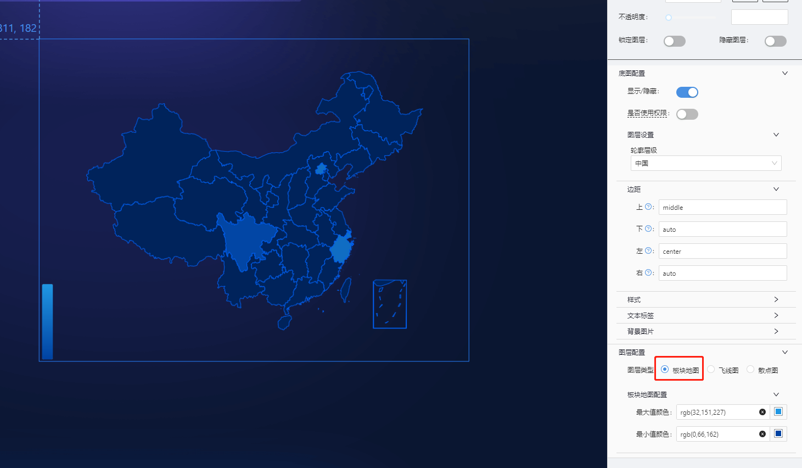

```json
对应的静态数据:
[
    {
        "id": "-1139861561",
        "name": "北京",
        "value": "100",
        "lon": "116.405285",
        "lat": "39.904989",
        "targetId": "354339340",
        "isCenter": "1",
        "level": "1"
    },
    {
        "id": "354339340",
        "name": "上海",
        "value": 100,
        "lon": "121.472644",
        "lat": "31.231706",
        "targetId": "-1139861561",
        "level": "3"
    },
    {
        "id": "-1308712042",
        "name": "浙江",
        "value": 100,
        "lon": "120.153576",
        "lat": "29",
        "targetId": "-1139861561",
        "level": "2"
    },
    {
        "id": "1059902420",
        "name": "四川",
        "value": 10,
        "lon": "103",
        "lat": "30.659462",
        "targetId": "-1139861561",
        "level": "4"
    }
]
```

### 飞线图

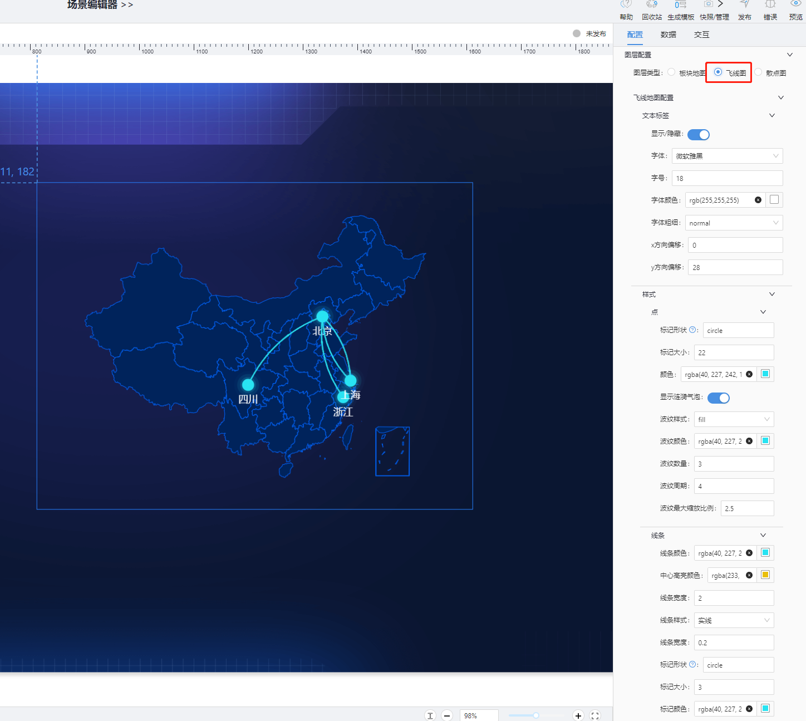

```json
数据同板块地图,数据释义如下
[{
        "id": "-1139861561", //飞线本端
        "name": "北京",
        "value": "100",
        "lon": "116.405285",//打点经度
        "lat": "39.904989",// 打点纬度
        "targetId": "354339340", // 飞线对端
        "isCenter": "1",//是否为飞线中心点
        "level": "1"//告警级别
    },
]
```

### 散点

散点配置较多,目前有:

**echarts 气泡,普通气泡 01, 普通气泡 02, 分组气泡 01, 分组气泡 02, 分组气泡 03**

#### echarts 气泡

支持显示文本及气泡颜色的设置

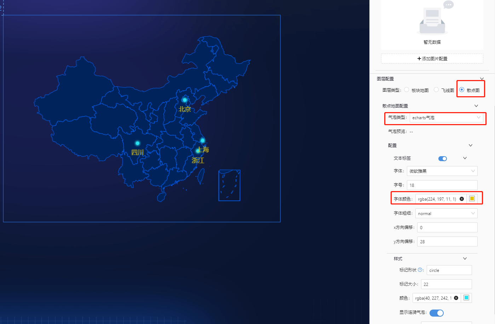

#### 普通气泡 01

支持显示文本/数值的样式配置,支持切换气泡的显示类型.

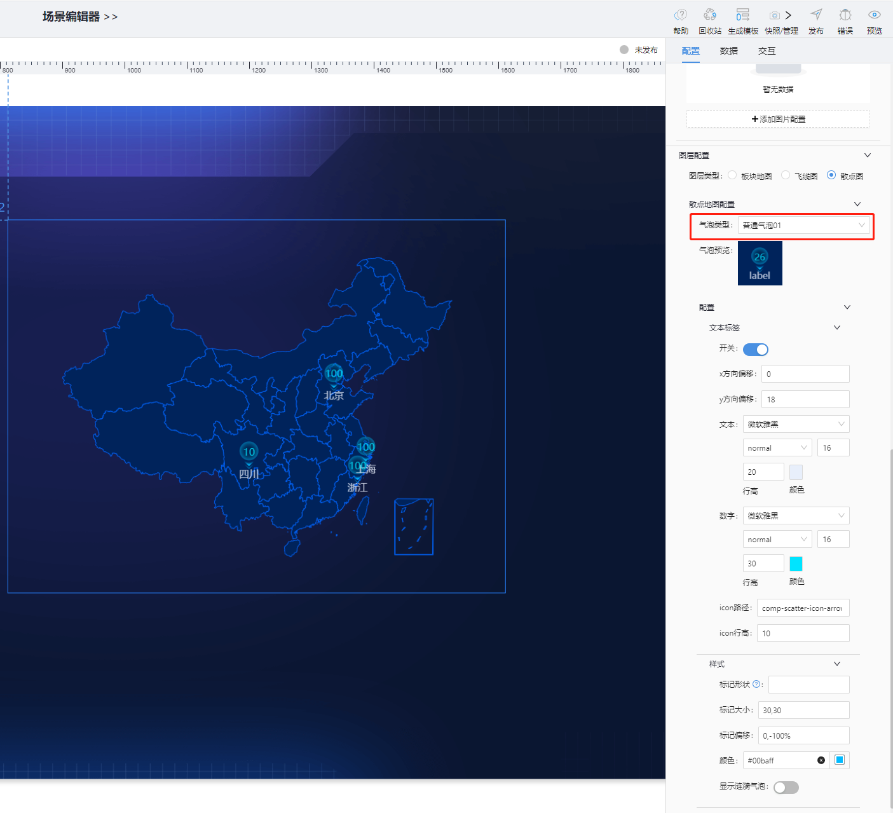

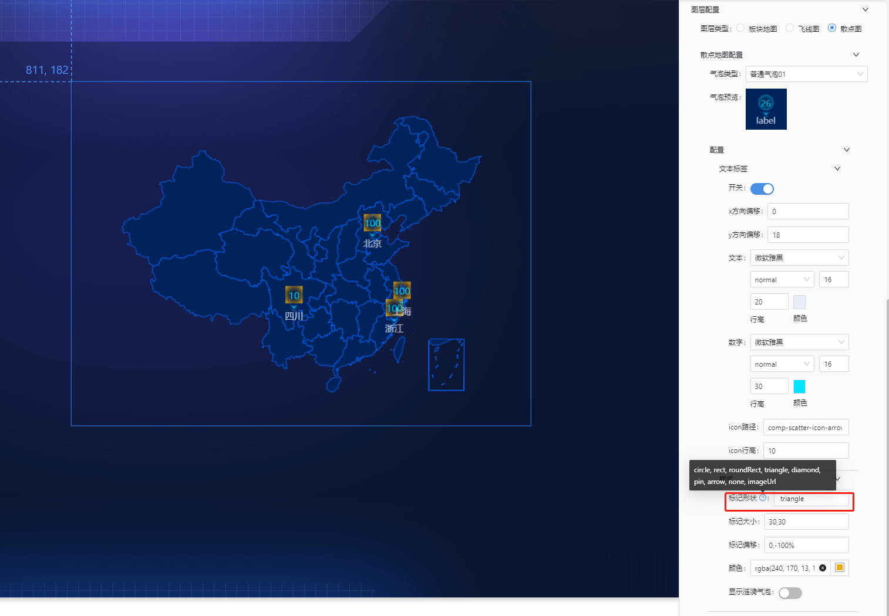

#### 普通气泡 02

支持切换气泡背景图片

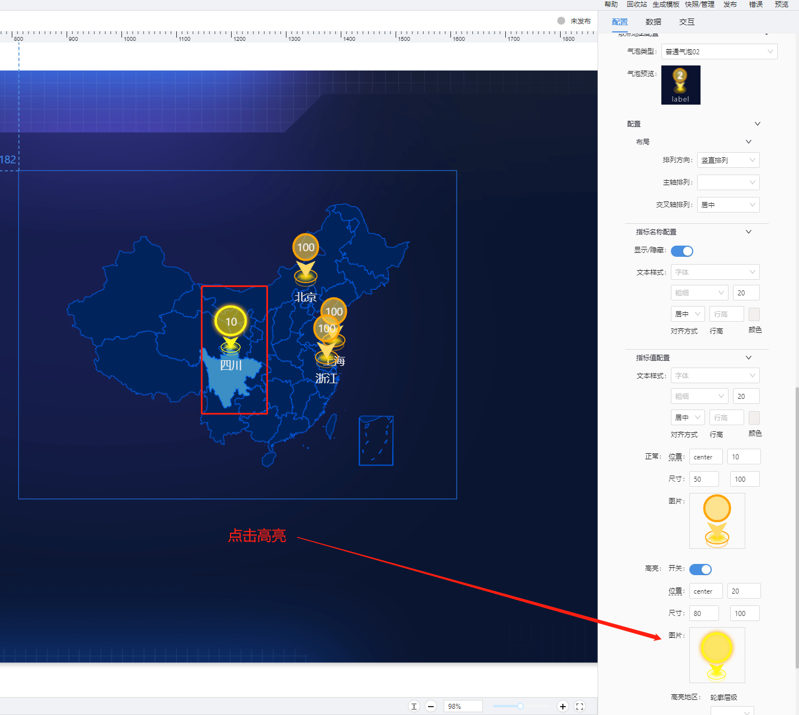

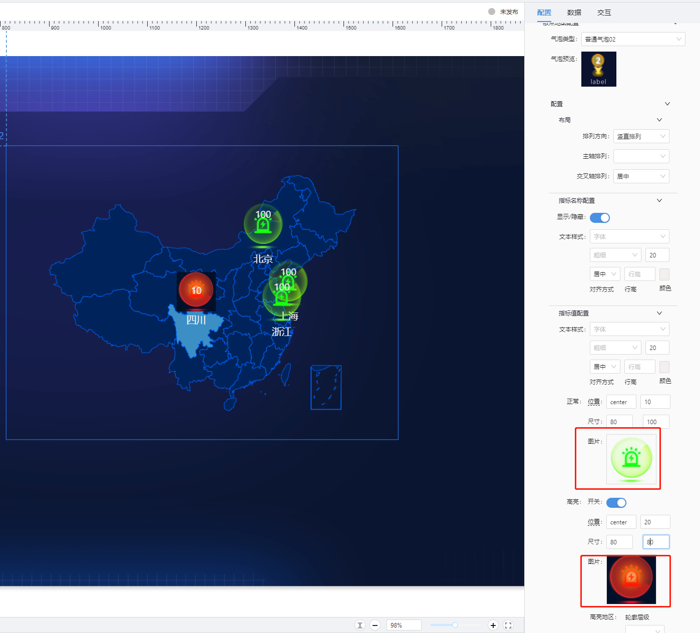

#### 分组气泡

```json
分组气泡对 数据中的 item_value_*, item_label_*, item_id_*进行汇总显示.
数据示例如下:
[
    {
        "id": "-1864644289",
        "id_format": "-1864644289",
        "name": "铜川市",
        "name_format": "铜川市",
        "lon": "",
        "lon_format": "",
        "lat": "",
        "lat_format": "",
        "unit": "",
        "unit_format": "",
        "level": "1",
        "level_format": "1",
        "item_label_total": "总量",
        "item_label_total_format": "总量",
        "item_value_total": "350",
        "item_value_total_format": "350",
        "item_id_total": "0",
        "item_id_total_format": "0",
        "item_label_5G": "5G",
        "item_label_5G_format": "5G",
        "item_value_5G": "1",
        "item_value_5G_format": "1",
        "item_id_5G": "3",
        "item_id_5G_format": "3",
        "item_label_4G": "4G",
        "item_label_4G_format": "4G",
        "item_value_4G": "345",
        "item_value_4G_format": "345",
        "item_id_4G": "2",
        "item_id_4G_format": "2",
        "item_label_2G": "3G",
        "item_label_2G_format": "3G",
        "item_value_2G": "4",
        "item_value_2G_format": "4",
        "item_id_2G": "1",
        "item_id_2G_format": "1"
    },
    {
        "id": "1835563162",
        "id_format": "1835563162",
        "name": "渭南市",
        "name_format": "渭南市",
        "lon": "",
        "lon_format": "",
        "lat": "",
        "lat_format": "",
        "unit": "",
        "unit_format": "",
        "level": "4",
        "level_format": "4",
        "item_label_total": "总量",
        "item_label_total_format": "总量",
        "item_value_total": "46",
        "item_value_total_format": "46",
        "item_id_total": "0",
        "item_id_total_format": "0",
        "item_label_5G": "5G",
        "item_label_5G_format": "5G",
        "item_value_5G": "23",
        "item_value_5G_format": "23",
        "item_id_5G": "3",
        "item_id_5G_format": "3",
        "item_label_4G": "4G",
        "item_label_4G_format": "4G",
        "item_value_4G": "22",
        "item_value_4G_format": "22",
        "item_id_4G": "2",
        "item_id_4G_format": "2",
        "item_label_2G": "3G",
        "item_label_2G_format": "3G",
        "item_value_2G": "1",
        "item_value_2G_format": "1",
        "item_id_2G": "1",
        "item_id_2G_format": "1"
    },
    {
        "id": "-821153149",
        "id_format": "-821153149",
        "name": "榆林地区",
        "name_format": "榆林地区",
        "lon": "",
        "lon_format": "",
        "lat": "",
        "lat_format": "",
        "unit": "",
        "unit_format": "",
        "level": "1",
        "level_format": "1",
        "item_label_total": "总量",
        "item_label_total_format": "总量",
        "item_value_total": "555",
        "item_value_total_format": "555",
        "item_id_total": "0",
        "item_id_total_format": "0",
        "item_label_5G": "5G",
        "item_label_5G_format": "5G",
        "item_value_5G": "23",
        "item_value_5G_format": "23",
        "item_id_5G": "3",
        "item_id_5G_format": "3",
        "item_label_4G": "4G",
        "item_label_4G_format": "4G",
        "item_value_4G": "456",
        "item_value_4G_format": "456",
        "item_id_4G": "2",
        "item_id_4G_format": "2",
        "item_label_2G": "3G",
        "item_label_2G_format": "3G",
        "item_value_2G": "76",
        "item_value_2G_format": "76",
        "item_id_2G": "1",
        "item_id_2G_format": "1"
    },
    {
        "id": "-1611548236",
        "id_format": "-1611548236",
        "name": "汉中市",
        "name_format": "汉中市",
        "lon": "",
        "lon_format": "",
        "lat": "",
        "lat_format": "",
        "unit": "",
        "unit_format": "",
        "level": "4",
        "level_format": "4",
        "item_label_total": "总量",
        "item_label_total_format": "总量",
        "item_value_total": "119",
        "item_value_total_format": "119",
        "item_id_total": "0",
        "item_id_total_format": "0",
        "item_label_5G": "5G",
        "item_label_5G_format": "5G",
        "item_value_5G": "23",
        "item_value_5G_format": "23",
        "item_id_5G": "3",
        "item_id_5G_format": "3",
        "item_label_4G": "4G",
        "item_label_4G_format": "4G",
        "item_value_4G": "87",
        "item_value_4G_format": "87",
        "item_id_4G": "2",
        "item_id_4G_format": "2",
        "item_label_2G": "3G",
        "item_label_2G_format": "3G",
        "item_value_2G": "9",
        "item_value_2G_format": "9",
        "item_id_2G": "1",
        "item_id_2G_format": "1"
    },
    {
        "id": "1421946993",
        "id_format": "1421946993",
        "name": "宝鸡市",
        "name_format": "宝鸡市",
        "lon": "",
        "lon_format": "",
        "lat": "",
        "lat_format": "",
        "unit": "",
        "unit_format": "",
        "level": "1",
        "level_format": "1",
        "item_label_total": "总量",
        "item_label_total_format": "总量",
        "item_value_total": "44",
        "item_value_total_format": "44",
        "item_id_total": "0",
        "item_id_total_format": "0",
        "item_label_5G": "5G",
        "item_label_5G_format": "5G",
        "item_value_5G": "23",
        "item_value_5G_format": "23",
        "item_id_5G": "3",
        "item_id_5G_format": "3",
        "item_label_4G": "4G",
        "item_label_4G_format": "4G",
        "item_value_4G": "13",
        "item_value_4G_format": "13",
        "item_id_4G": "2",
        "item_id_4G_format": "2",
        "item_label_2G": "3G",
        "item_label_2G_format": "3G",
        "item_value_2G": "8",
        "item_value_2G_format": "8",
        "item_id_2G": "1",
        "item_id_2G_format": "1"
    },
    {
        "id": "270525996",
        "id_format": "270525996",
        "name": "咸阳市",
        "name_format": "咸阳市",
        "lon": "",
        "lon_format": "",
        "lat": "",
        "lat_format": "",
        "unit": "",
        "unit_format": "",
        "level": "1",
        "level_format": "1",
        "item_label_total": "总量",
        "item_label_total_format": "总量",
        "item_value_total": "2341",
        "item_value_total_format": "2341",
        "item_id_total": "0",
        "item_id_total_format": "0",
        "item_label_5G": "5G",
        "item_label_5G_format": "5G",
        "item_value_5G": "2334",
        "item_value_5G_format": "2334",
        "item_id_5G": "3",
        "item_id_5G_format": "3",
        "item_label_4G": "4G",
        "item_label_4G_format": "4G",
        "item_value_4G": "2",
        "item_value_4G_format": "2",
        "item_id_4G": "2",
        "item_id_4G_format": "2",
        "item_label_2G": "3G",
        "item_label_2G_format": "3G",
        "item_value_2G": "5",
        "item_value_2G_format": "5",
        "item_id_2G": "1",
        "item_id_2G_format": "1"
    },
    {
        "id": "633221974",
        "id_format": "633221974",
        "name": "商洛地区",
        "name_format": "商洛地区",
        "lon": "",
        "lon_format": "",
        "lat": "",
        "lat_format": "",
        "unit": "",
        "unit_format": "",
        "level": "1",
        "level_format": "1",
        "item_label_total": "总量",
        "item_label_total_format": "总量",
        "item_value_total": "62",
        "item_value_total_format": "62",
        "item_id_total": "0",
        "item_id_total_format": "0",
        "item_label_5G": "5G",
        "item_label_5G_format": "5G",
        "item_value_5G": "56",
        "item_value_5G_format": "56",
        "item_id_5G": "3",
        "item_id_5G_format": "3",
        "item_label_4G": "4G",
        "item_label_4G_format": "4G",
        "item_value_4G": "2",
        "item_value_4G_format": "2",
        "item_id_4G": "2",
        "item_id_4G_format": "2",
        "item_label_2G": "3G",
        "item_label_2G_format": "3G",
        "item_value_2G": "4",
        "item_value_2G_format": "4",
        "item_id_2G": "1",
        "item_id_2G_format": "1"
    },
    {
        "id": "-1520843953",
        "id_format": "-1520843953",
        "name": "安康地区",
        "name_format": "安康地区",
        "lon": "",
        "lon_format": "",
        "lat": "",
        "lat_format": "",
        "unit": "",
        "unit_format": "",
        "level": "4",
        "level_format": "4",
        "item_label_total": "总量",
        "item_label_total_format": "总量",
        "item_value_total": "251",
        "item_value_total_format": "251",
        "item_id_total": "0",
        "item_id_total_format": "0",
        "item_label_5G": "5G",
        "item_label_5G_format": "5G",
        "item_value_5G": "234",
        "item_value_5G_format": "234",
        "item_id_5G": "3",
        "item_id_5G_format": "3",
        "item_label_4G": "4G",
        "item_label_4G_format": "4G",
        "item_value_4G": "12",
        "item_value_4G_format": "12",
        "item_id_4G": "2",
        "item_id_4G_format": "2",
        "item_label_2G": "3G",
        "item_label_2G_format": "3G",
        "item_value_2G": "5",
        "item_value_2G_format": "5",
        "item_id_2G": "1",
        "item_id_2G_format": "1"
    },
    {
        "id": "1023337600",
        "id_format": "1023337600",
        "name": "延安市",
        "name_format": "延安市",
        "lon": "",
        "lon_format": "",
        "lat": "",
        "lat_format": "",
        "unit": "",
        "unit_format": "",
        "level": "1",
        "level_format": "1",
        "item_label_total": "总量",
        "item_label_total_format": "总量",
        "item_value_total": "4",
        "item_value_total_format": "4",
        "item_id_total": "0",
        "item_id_total_format": "0",
        "item_label_5G": "5G",
        "item_label_5G_format": "5G",
        "item_value_5G": "2",
        "item_value_5G_format": "2",
        "item_id_5G": "3",
        "item_id_5G_format": "3",
        "item_label_4G": "4G",
        "item_label_4G_format": "4G",
        "item_value_4G": "1",
        "item_value_4G_format": "1",
        "item_id_4G": "2",
        "item_id_4G_format": "2",
        "item_label_2G": "3G",
        "item_label_2G_format": "3G",
        "item_value_2G": "1",
        "item_value_2G_format": "1",
        "item_id_2G": "1",
        "item_id_2G_format": "1"
    })
]
```

##### 分组气泡 01

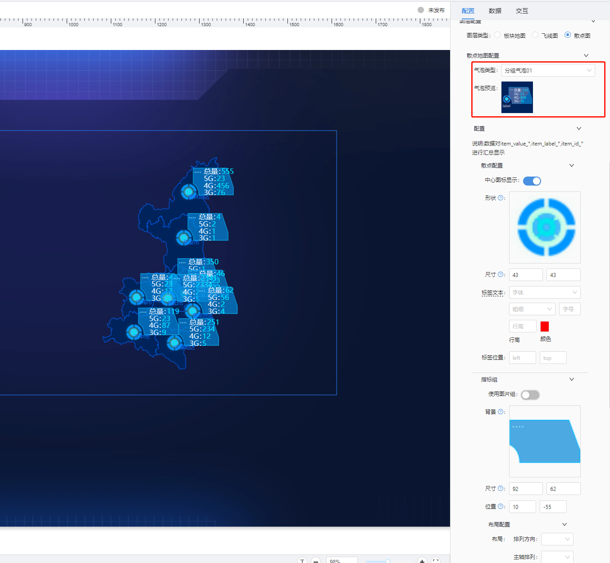

-   基本組成


-   中心图标 + 标签

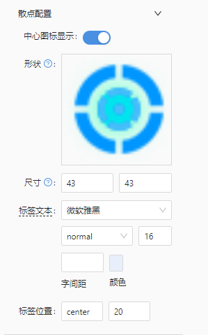

-   指标组基本配置

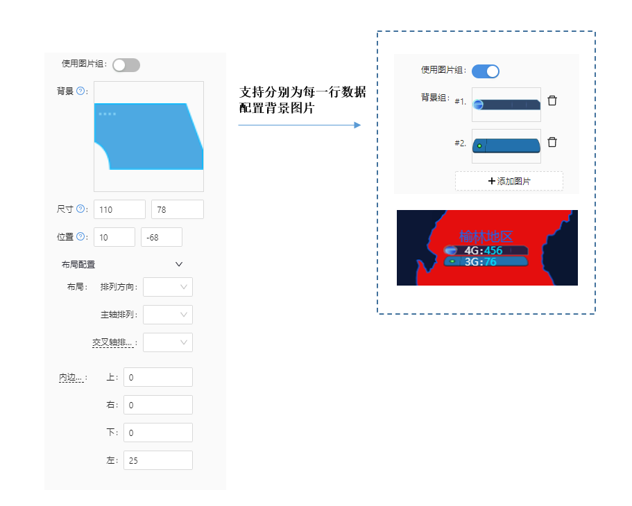

-   分组指标配置

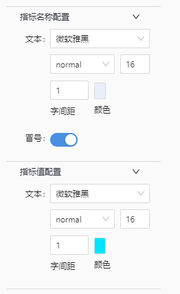

##### 分组气泡 02

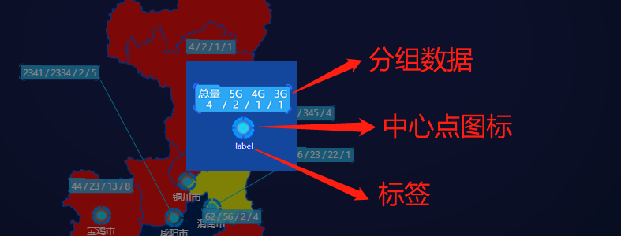

-   中心点+标签文本,配置同[分组气泡 01]
-   分组指标配置

    -   基本配置

    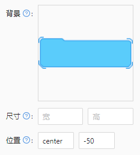

    -   指标布局配置

    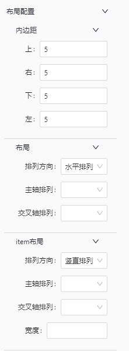

    -   指标名称+指标值

    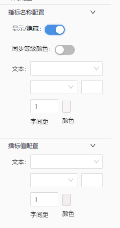

    -   指标值颜色

    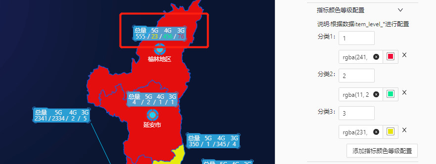

    -   指标指引线配置

    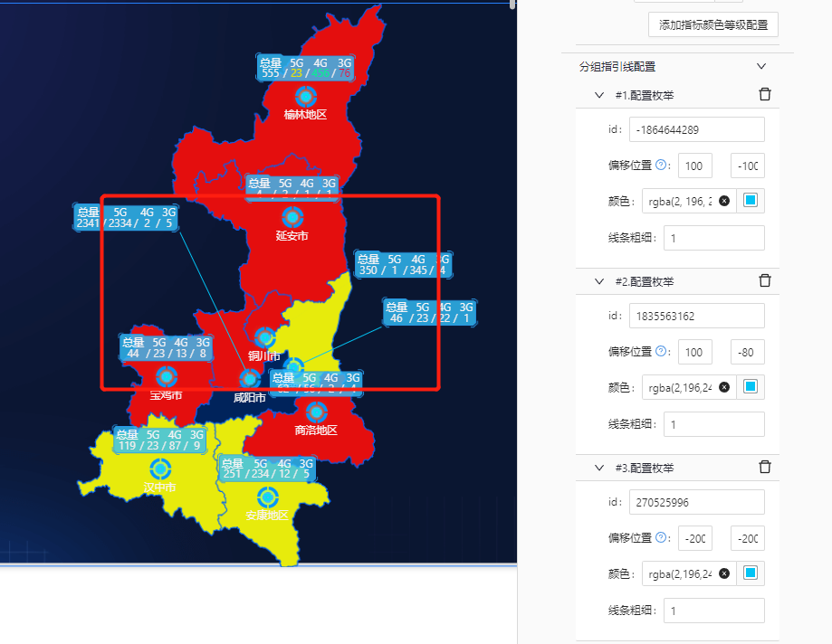

##### 分组气泡 03

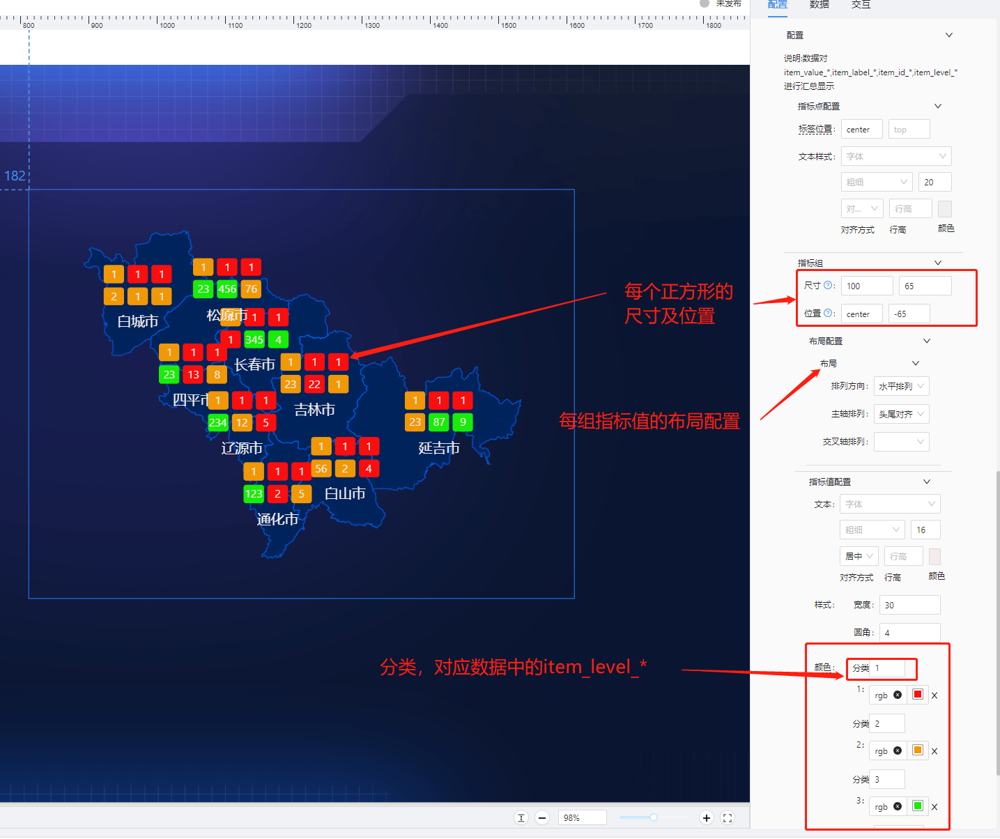

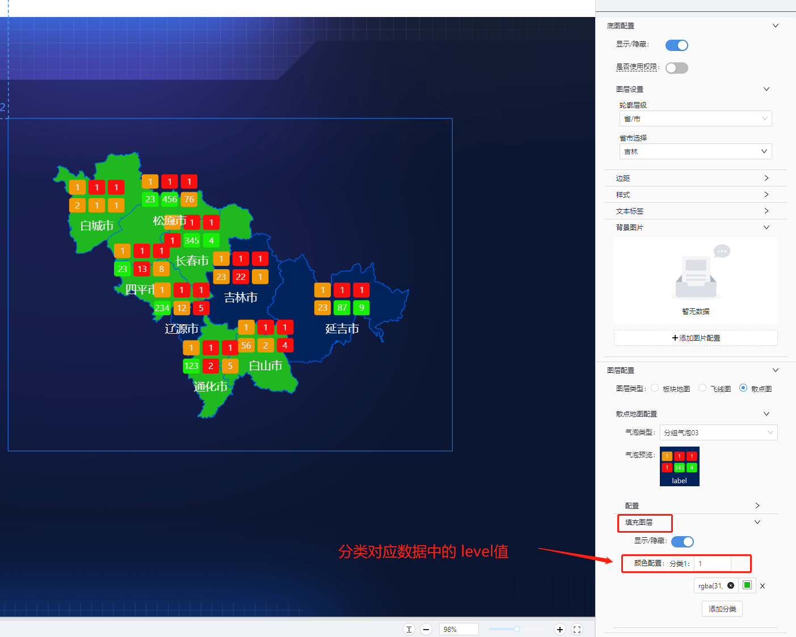

```json
测试数据:
[
    {
        "id": "161741224",
        "name": "长春市",
        "lon": "125.4245",
        "lat": "44.286841",
        "level": "1",
        "item_label_5G_ot": "5G_ot",
        "item_id_5G_ot": "5G_ot",
        "item_value_5G_ot": "1",
        "item_level_5G_ot": "2",
        "item_label_4G_ot": "4g-ot",
        "item_id_4G_ot": "4G_ot",
        "item_value_4G_ot": "1",
        "item_level_4G_ot": "1",
        "item_label_2G_ot": "2g-ot",
        "item_id_2G_ot": "2G_ot",
        "item_value_2G_ot": "1",
        "item_level_2G_ot": "1",
        "item_label_5G": "5G",
        "item_value_5G": "1",
        "item_level_5G": "1",
        "item_id_5G": "3",
        "item_label_4G": "4G",
        "item_value_4G": "345",
        "item_id_4G": "2",
        "item_label_2G": "3G",
        "item_value_2G": "4",
        "item_id_2G": "1",
        "item_level_4G": "3",
        "item_level_2G": "3"
    },
    {
        "id": "1525258230",
        "name": "吉林市",
        "lon": "126.75302",
        "lat": "43.543577",
        "level": "4",
        "item_label_5G_ot": "5G_ot",
        "item_id_5G_ot": "5G_ot",
        "item_value_5G_ot": "1",
        "item_level_5G_ot": "2",
        "item_label_4G_ot": "4g-ot",
        "item_id_4G_ot": "4G_ot",
        "item_value_4G_ot": "1",
        "item_level_4G_ot": "1",
        "item_label_2G_ot": "2g-ot",
        "item_id_2G_ot": "2G_ot",
        "item_value_2G_ot": "1",
        "item_level_2G_ot": "1",
        "item_label_5G": "5G",
        "item_value_5G": "23",
        "item_id_5G": "3",
        "item_label_4G": "4G",
        "item_value_4G": "22",
        "item_id_4G": "2",
        "item_label_2G": "3G",
        "item_value_2G": "1",
        "item_id_2G": "1",
        "item_level_5G": "2",
        "item_level_4G": "1",
        "item_level_2G": "2"
    },
    {
        "id": "-1388345586",
        "name": "松原市",
        "level": "1",
        "item_label_5G_ot": "5G_ot",
        "item_id_5G_ot": "5G_ot",
        "item_value_5G_ot": "1",
        "item_level_5G_ot": "2",
        "item_label_4G_ot": "4g-ot",
        "item_id_4G_ot": "4G_ot",
        "item_value_4G_ot": "1",
        "item_level_4G_ot": "1",
        "item_label_2G_ot": "2g-ot",
        "item_id_2G_ot": "2G_ot",
        "item_value_2G_ot": "1",
        "item_level_2G_ot": "1",
        "item_label_5G": "5G",
        "item_value_5G": "23",
        "item_id_5G": "3",
        "item_label_4G": "4G",
        "item_value_4G": "456",
        "item_id_4G": "2",
        "item_label_2G": "3G",
        "item_value_2G": "76",
        "item_id_2G": "1",
        "item_level_5G": "3",
        "item_level_4G": "3",
        "item_level_2G": "2"
    },
    {
        "id": "-553656135",
        "name": "延吉市",
        "level": "4",
        "item_label_5G_ot": "5G_ot",
        "item_id_5G_ot": "5G_ot",
        "item_value_5G_ot": "1",
        "item_level_5G_ot": "2",
        "item_label_4G_ot": "4g-ot",
        "item_id_4G_ot": "4G_ot",
        "item_value_4G_ot": "1",
        "item_level_4G_ot": "1",
        "item_label_2G_ot": "2g-ot",
        "item_id_2G_ot": "2G_ot",
        "item_value_2G_ot": "1",
        "item_level_2G_ot": "1",
        "item_label_5G": "5G",
        "item_value_5G": "23",
        "item_id_5G": "3",
        "item_label_4G": "4G",
        "item_value_4G": "87",
        "item_id_4G": "2",
        "item_label_2G": "3G",
        "item_value_2G": "9",
        "item_id_2G": "1",
        "item_level_5G": "2",
        "item_level_4G": "3",
        "item_level_2G": "3"
    },
    {
        "id": "-1281785893",
        "name": "四平市",
        "lon": "124.070785",
        "lat": "43.700344",
        "level": "1",
        "item_label_5G_ot": "5G_ot",
        "item_id_5G_ot": "5G_ot",
        "item_value_5G_ot": "1",
        "item_level_5G_ot": "2",
        "item_label_4G_ot": "4g-ot",
        "item_id_4G_ot": "4G_ot",
        "item_value_4G_ot": "1",
        "item_level_4G_ot": "1",
        "item_label_2G_ot": "2g-ot",
        "item_id_2G_ot": "2G_ot",
        "item_value_2G_ot": "1",
        "item_level_2G_ot": "1",
        "item_label_5G": "5G",
        "item_value_5G": "23",
        "item_id_5G": "3",
        "item_label_4G": "4G",
        "item_value_4G": "13",
        "item_id_4G": "2",
        "item_label_2G": "3G",
        "item_value_2G": "8",
        "item_id_2G": "1",
        "item_level_5G": "3",
        "item_level_4G": "1",
        "item_level_2G": "2"
    },
    {
        "id": "-1074460203",
        "name": "通化市",
        "level": "1",
        "item_label_5G_ot": "5G_ot",
        "item_id_5G_ot": "5G_ot",
        "item_value_5G_ot": "1",
        "item_level_5G_ot": "2",
        "item_label_4G_ot": "4g-ot",
        "item_id_4G_ot": "4G_ot",
        "item_value_4G_ot": "1",
        "item_level_4G_ot": "1",
        "item_label_2G_ot": "2g-ot",
        "item_id_2G_ot": "2G_ot",
        "item_value_2G_ot": "1",
        "item_level_2G_ot": "1",
        "item_label_5G": "5G",
        "item_value_5G": "123",
        "item_id_5G": "3",
        "item_label_4G": "4G",
        "item_value_4G": "2",
        "item_id_4G": "2",
        "item_label_2G": "3G",
        "item_value_2G": "5",
        "item_id_2G": "1",
        "item_level_5G": "3",
        "item_level_4G": "1",
        "item_level_2G": "2"
    },
    {
        "id": "-1386250275",
        "name": "白山市",
        "lon": "127.427839",
        "lat": "42.142505",
        "level": "1",
        "item_label_5G_ot": "5G_ot",
        "item_id_5G_ot": "5G_ot",
        "item_value_5G_ot": "1",
        "item_level_5G_ot": "2",
        "item_label_4G_ot": "4g-ot",
        "item_id_4G_ot": "4G_ot",
        "item_value_4G_ot": "1",
        "item_level_4G_ot": "1",
        "item_label_2G_ot": "2g-ot",
        "item_id_2G_ot": "2G_ot",
        "item_value_2G_ot": "1",
        "item_level_2G_ot": "1",
        "item_label_5G": "5G",
        "item_value_5G": "56",
        "item_id_5G": "3",
        "item_label_4G": "4G",
        "item_value_4G": "2",
        "item_id_4G": "2",
        "item_label_2G": "3G",
        "item_value_2G": "4",
        "item_id_2G": "1",
        "item_level_5G": "2",
        "item_level_4G": "2",
        "item_level_2G": "1"
    },
    {
        "id": "525548695",
        "name": "辽源市",
        "level": "4",
        "item_label_5G_ot": "5G_ot",
        "item_id_5G_ot": "5G_ot",
        "item_value_5G_ot": "1",
        "item_level_5G_ot": "2",
        "item_label_4G_ot": "4g-ot",
        "item_id_4G_ot": "4G_ot",
        "item_value_4G_ot": "1",
        "item_level_4G_ot": "1",
        "item_label_2G_ot": "2g-ot",
        "item_id_2G_ot": "2G_ot",
        "item_value_2G_ot": "1",
        "item_level_2G_ot": "1",
        "item_label_5G": "5G",
        "item_value_5G": "234",
        "item_id_5G": "3",
        "item_label_4G": "4G",
        "item_value_4G": "12",
        "item_id_4G": "2",
        "item_label_2G": "3G",
        "item_value_2G": "5",
        "item_id_2G": "1",
        "item_level_5G": "3",
        "item_level_4G": "2",
        "item_level_2G": "1"
    },
    {
        "id": "-256126301",
        "name": "白城市",
        "lon": "122.841114",
        "lat": "44.999026",
        "level": "1",
        "item_label_5G_ot": "5G_ot",
        "item_id_5G_ot": "5G_ot",
        "item_value_5G_ot": "1",
        "item_level_5G_ot": "2",
        "item_label_4G_ot": "4g-ot",
        "item_id_4G_ot": "4G_ot",
        "item_value_4G_ot": "1",
        "item_level_4G_ot": "1",
        "item_label_2G_ot": "2g-ot",
        "item_id_2G_ot": "2G_ot",
        "item_value_2G_ot": "1",
        "item_level_2G_ot": "1",
        "item_label_5G": "5G",
        "item_value_5G": "2",
        "item_id_5G": "3",
        "item_label_4G": "4G",
        "item_value_4G": "1",
        "item_id_4G": "2",
        "item_label_2G": "3G",
        "item_value_2G": "1",
        "item_id_2G": "1",
        "item_level_5G": "2",
        "item_level_4G": "2",
        "item_level_2G": "2"
    }
]
```

## 配置项

## 基础配置

-   默认选中
-   轮播配置
-   常规元素配置(元素设置)
-   选中(高亮)元素设置

### 数据

见以上配置示例.

### 交互

-   支持点击地图板块或打点指标展示弹框或抽屉
-   支持点击地图板块或打点指标时,向外派发数值
-   参数派发及事件派发原则上互斥

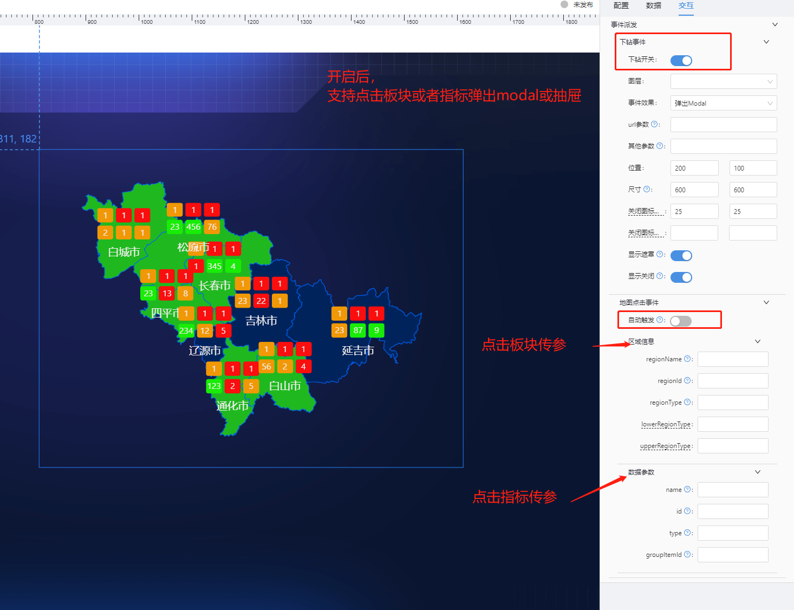

可派发的值,是根据数据而定的,我们举例数据如下:

```json
以气泡 03 的数据,点击 吉林市或吉林市的指标为例:
[{
        "id": "1525258230",
        "name": "吉林市",
        "lon": "126.75302",
        "lat": "43.543577",
        "level": "4",
        "item_label_5G_ot": "5G_ot",
        "item_id_5G_ot": "5G_ot",
        "item_value_5G_ot": "1",
        "item_level_5G_ot": "2",
        "item_label_4G_ot": "4g-ot",
        "item_id_4G_ot": "4G_ot",
        "item_value_4G_ot": "1",
        "item_level_4G_ot": "1",
        "item_label_2G_ot": "2g-ot",
        "item_id_2G_ot": "2G_ot",
        "item_value_2G_ot": "1",
        "item_level_2G_ot": "1",
        "item_label_5G": "5G",
        "item_value_5G": "23",
        "item_id_5G": "3",
        "item_label_4G": "4G",
        "item_value_4G": "22",
        "item_id_4G": "2",
        "item_label_2G": "3G",
        "item_value_2G": "1",
        "item_id_2G": "1",
        "item_level_5G": "2",
        "item_level_4G": "1",
        "item_level_2G": "2"
    },]
```

```js
   示例配置:
    区域信息
        regionName:regionName
        regionId:regionId
        regionType:regionType
        lowerRegionType:lowerRegionType
        upperRegionType:upperRegionType

    数据参数:
        name:name
        id:id
        type:type
        groupItemId:groupItemId

    点击吉林板块地图时,对外派发的参数为:
     {
        lowerRegionType: "10004",//吉林市下一级类型码
        regionId: "1525258230",
        regionName: "吉林市",
        regionType: "10003",
        upperRegionType: "10000",//吉林市上一级类型码
        id: "1525258230"
        name: "1525258230"
     }

    点击 5G指标,对外派发的参数为:
    {
        name: "5G",
        value: "23",
        groupItemId: "3",
        level: "2",
        id: "1525258230",
        regionName: "吉林市",
        regionId: "1525258230",
        regionType: "10003",
        lowerRegionType: "10004",
        upperRegionType: "10000"
    }


    type,按照定义与字段中的type字段对应,以上样例中无type字段,因此派发的参数中,无type的值.

    groupItemId,groupItemId按照定义,在分组气泡时,与item_id_*字段映射
```

## 更新说明
