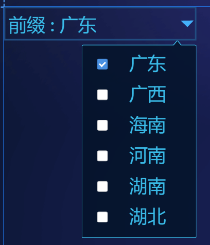
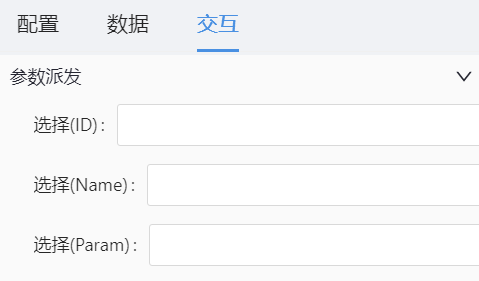

# 下拉选择框带参数(popover-checkparam) 组件

## 简述

-   用于支持下拉框数据呈现
-   支持指标名称展示
-   支持下拉框样式配置
-   支持点击联动事件
-   其他属性按需配置

## 支持的呈现形式

### 下拉框数据显示



## 配置项

## 基础配置

-   功能设置
-   选择框样式
-   弹窗样式
-   箭头样式

### 数据

```json
[
    {
        "id": "id-01",
        "label": "广东",
        "param": ""
    },
    {
        "id": "id-02",
        "label": "广西",
        "param": ""
    },
    {
        "id": "id-03",
        "label": "海南",
        "param": ""
    },
    {
        "id": "id-04",
        "label": "河南",
        "param": ""
    },
    {
        "id": "id-05",
        "label": "湖南",
        "param": ""
    },
    {
        "id": "id-06",
        "label": "湖北",
        "param": ""
    }
]
```

### 交互

-   支持选择下拉框数据,向外派发数值



可派发的值,是根据数据而定的,我们举例数据如下:

## 更新说明
