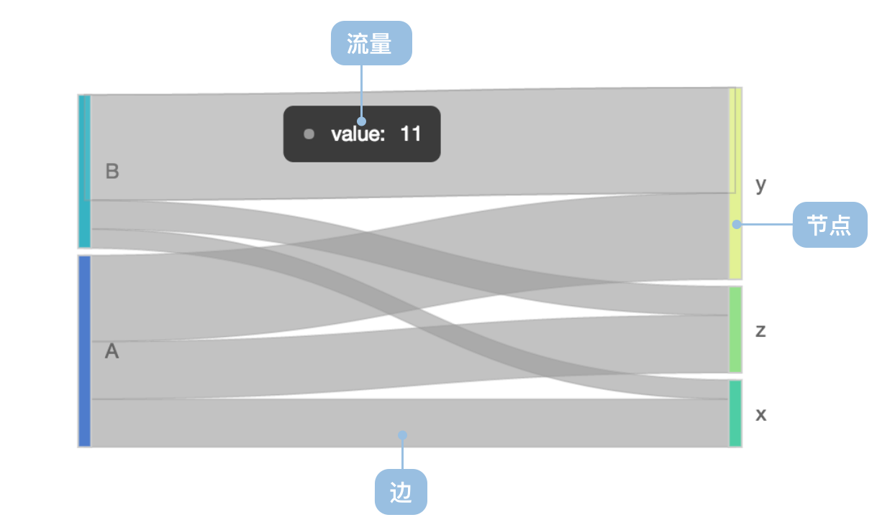
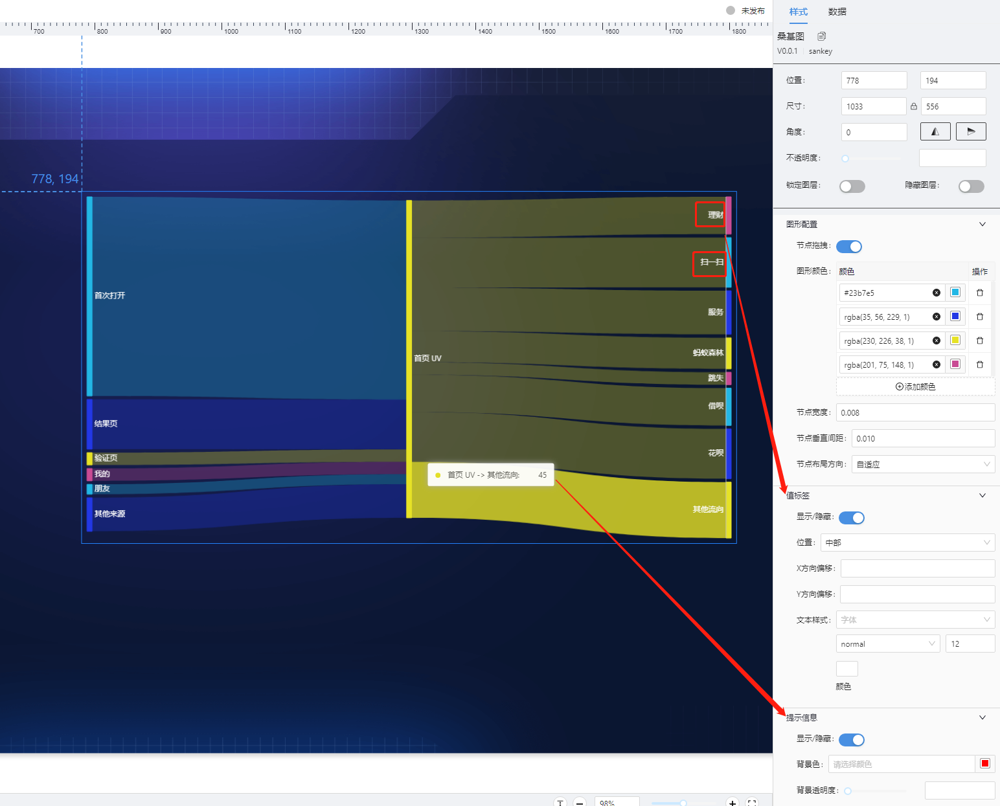

# 桑基图(Sankey) 组件

## 简述

桑基图 (Sankey Diagram)，是一种特定类型的流图，用于描述一组值到另一组值的流向。上图为 1869 年，查尔斯米纳德（Charles Minard）绘制的 1812 年拿破仑征俄图（Map of Napolean's Russian Campaign of 1812），这是一个在地图上覆盖桑基图的流程图。1898 年爱尔兰人 Matthew Henry Phineas Riall Sankey 在土木工程师学会会报纪要的一篇关于蒸汽机能源效率的文章中首次推出了第一个能量流动图，此后便以其名字命名为 Sankey 图，中文音译为桑基图。

图中延伸的分支的宽度对应数据流量的大小。

桑基图的特点如下：

起始流量和结束流量相同，所有主支宽度的总和与所有分出去的分支宽度总和相等，保持能量的平衡；在内部，不同的线条代表了不同的流量分流情况，它的宽度成比例地显示此分支占有的流量；节点不同的宽度代表了特定状态下的流量大小。

桑基图通常应用于能源、材料成分、金融等数据的可视化分析。

英文名：Sankey Diagram

## 桑基图的构成



| 分类             | 说明                         |
| ---------------- | ---------------------------- |
| 适合的数据       | 节点数据集（可选），边数据集 |
| 功能             | 观察节点关系                 |
| 数据与图形的映射 | 权重映射到节点和边的宽度     |
| 适合的数据条数   | 10 条以上                    |

### 配置说明



#### 图形颜色

     图形的颜色支持自定义,如果自定义的色值数,小于实际数据数量,组件会自主分配颜色.

#### 节点宽度

    桑基图节点的宽度配置，取值区间 0 ~ 1，参考画布的宽度，默认为 0.008.

#### 节点垂直间距

    桑基图节点的之间垂直方向的间距，取值区间 0 ~ 1，参考画布的高度，默认为 0.01。

## 组件逻辑

通过自研的图表组件实现.

## 配置项

## 基础配置

-   值标签设置
-   图形图样式设置
-   提示显隐及提示框背景色设置

### 数据

-   支持的接入方式:静态 json/API 接口/数据集
-   API 接口,确定使用 API 接口接入数据,需要联系平台研发,确定接口格式.
-   静态数据格式

```json
[
    {
        "source": "首次打开",
        "target": "首页 UV",
        "value": 160
    },
    {
        "source": "结果页",
        "target": "首页 UV",
        "value": 40
    },
    {
        "source": "验证页",
        "target": "首页 UV",
        "value": 10
    }
]
```

### 交互

暂无交互能力

## 桑基图拓展

### 适合的场景

数据的流向 桑基图即桑基能量分流图，也叫桑基能量平衡图,例如:能源产出的分布以及能源的用途和损耗

### 不适合的场景

边的起始流量和结束流量不同：桑基图需要保持能量守恒，不能在中间过程创造出流量，流失（损耗）的流量应流向表示损耗的节点，所以每条边的宽度是保持不变的，需要改变边的宽度的数据推荐使用和弦图

### 与其他图表的对比

桑基图和和弦图

-   桑基图可以描述多级关系，按照层级给节点分类；和弦图不分层级，表示节点间的相互关联
-   桑基图的边的权重保持不变；和弦图的边可以使用不同的初始权重和结束权重，宽度会有所变化

### 扩展阅读

-   http://ecowest.org/2013/05/06/sankey-energy/
-   https://antv.antfin.com/zh-cn/vis/chart/sankey.html

## 更新说明
