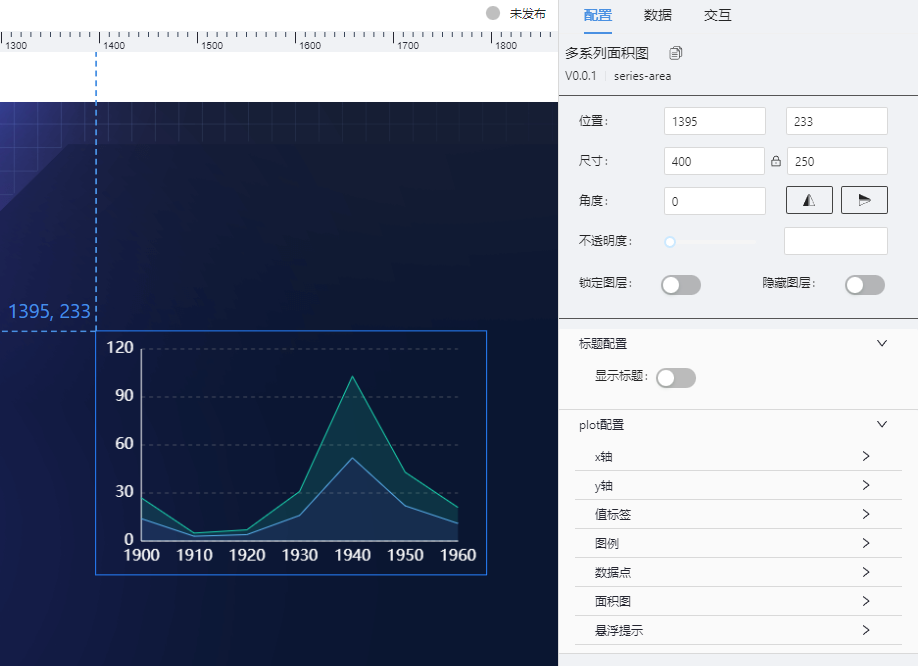
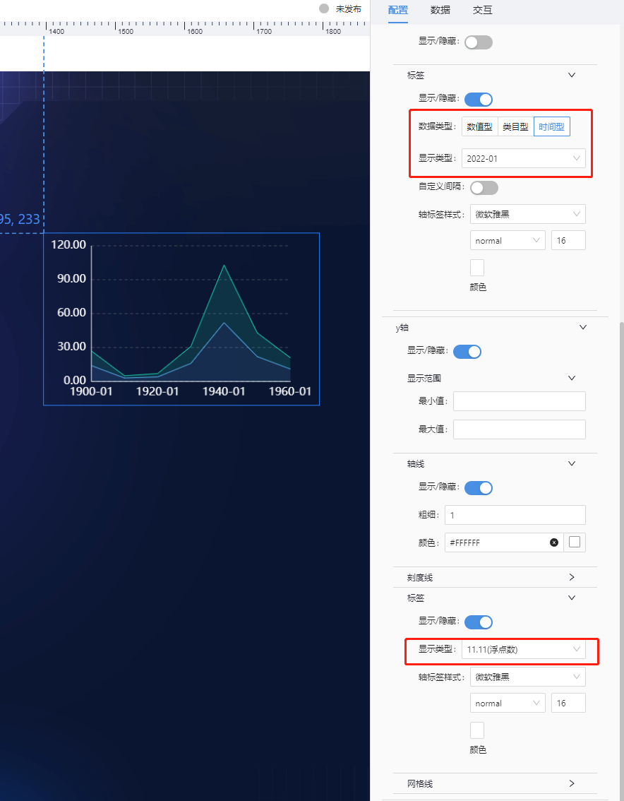
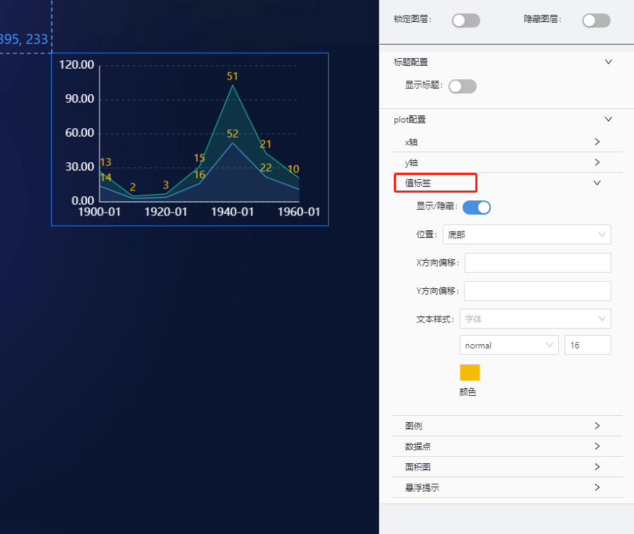
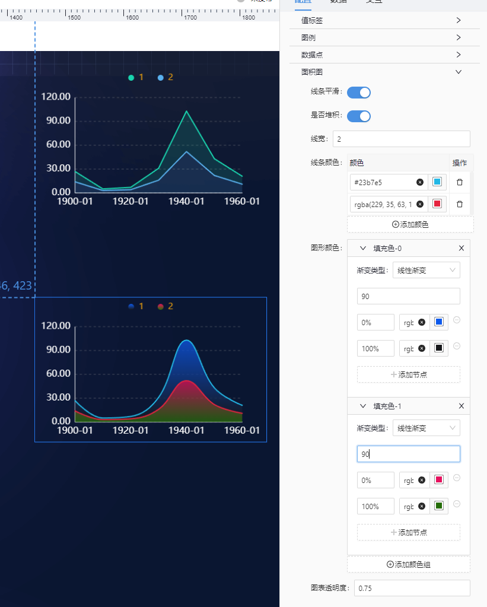
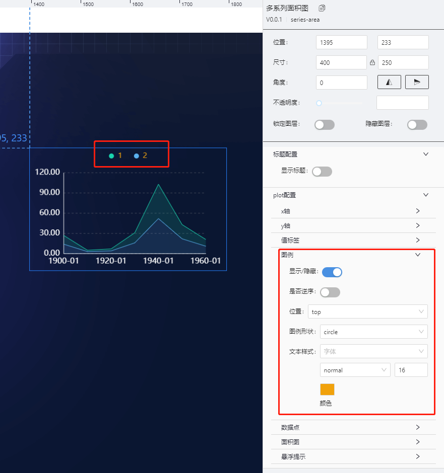
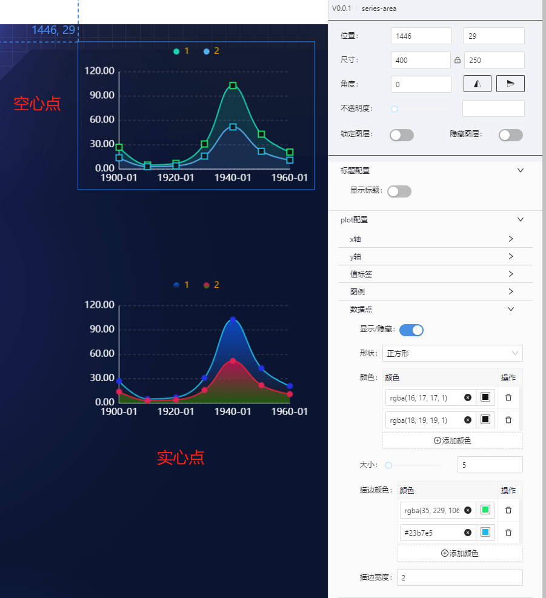
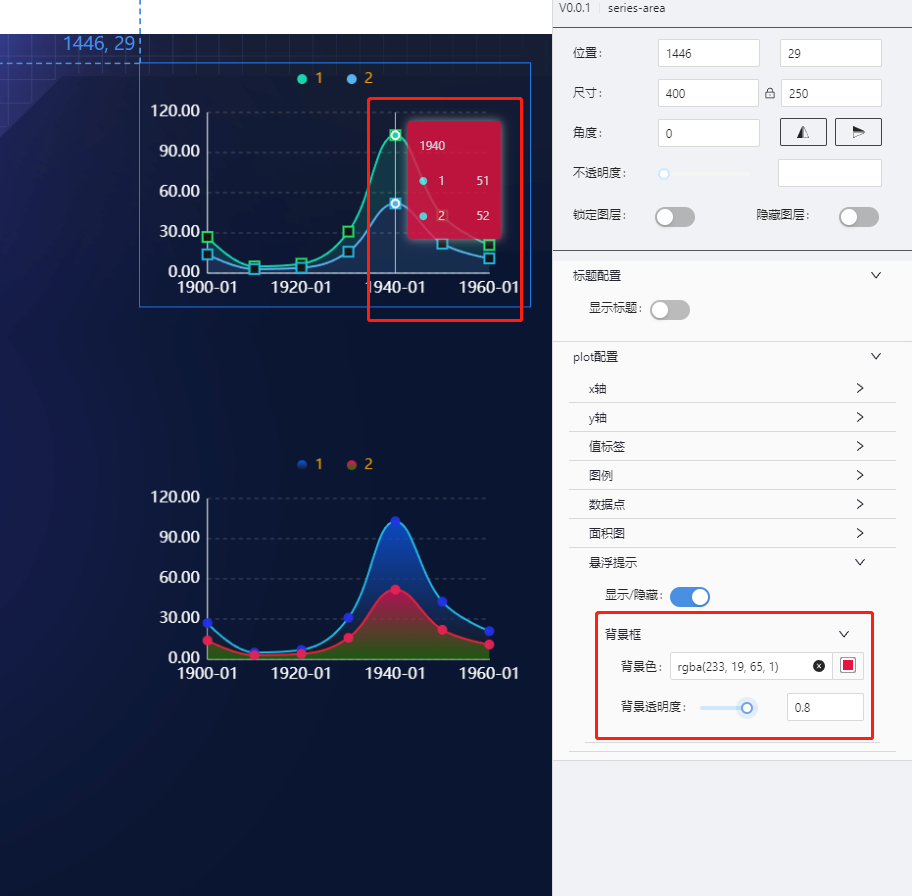
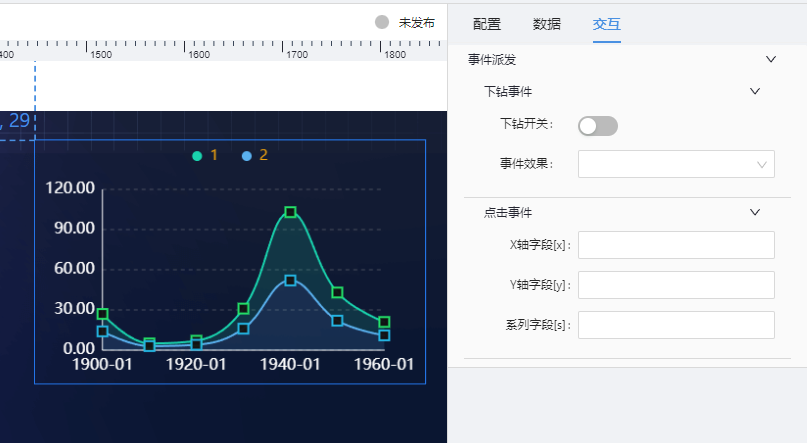

# 多系列面积(series-area) 组件

## 简述

面积图可用来展示连续性数据，可很好地表示趋势、累积、减少以及变化。 堆叠面积图更擅于展示部分和整体之间的关系或趋势，而不是传达特定的值。

## 支持的呈现形式

### 基础堆多系列图



### 坐标轴格式化



### 值标签设置



### 图形设置



### 图例配置



### 数据点配置



### 悬浮提示设置



## 组件逻辑

通过自研的图表组件实现.

## 配置项

## 基础配置

-   坐标轴设置(轴线/刻度线/网格线/轴标签)
-   值标签设置
-   图例设置
-   图形图样式设置(支持渐变色)
-   数据点样式色值
-   悬浮提示显隐及提示框背景色设置

### 数据

```json
[
    {
        "y": 13, //Y轴数据
        "x": "1900", //X轴数据
        "s": "1" //图例轴数据
    },
    {
        "y": 2,
        "x": "1910",
        "s": "1"
    },
    {
        "y": 3,
        "x": "1920",
        "s": "1"
    },

    {
        "y": 14,
        "x": "1900",
        "s": "2"
    },
    {
        "y": 3,
        "x": "1910",
        "s": "2"
    },
    {
        "y": 4,
        "x": "1920",
        "s": "2"
    }
]
```

### 交互

支持点击图形下钻及事件派发 

-   支持点击图形展示弹框或抽屉
-   支持点击图形时,向外派发数值

    ```js
       示例配置:
       X轴字段[x] : paramX
       Y轴字段[y] : paramY
       系列字段[s]: paramS

       数示例数据:
      [
        {
            "y": 13, //Y轴数据
            "x": "1900", //X轴数据
            "s": "1" //图例轴数据
        },
        {
            "y": 14,
            "x": "1900",
            "s": "2"
    },
      ]
      则点击一个数据点,对外派发的参数为:
      {paramX:"1900",paramY:1,paramS:"1"}

    ```

## 更新说明
