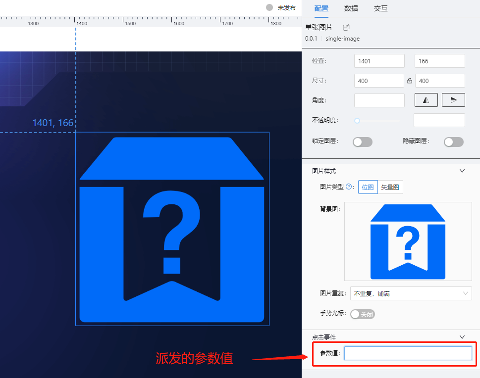
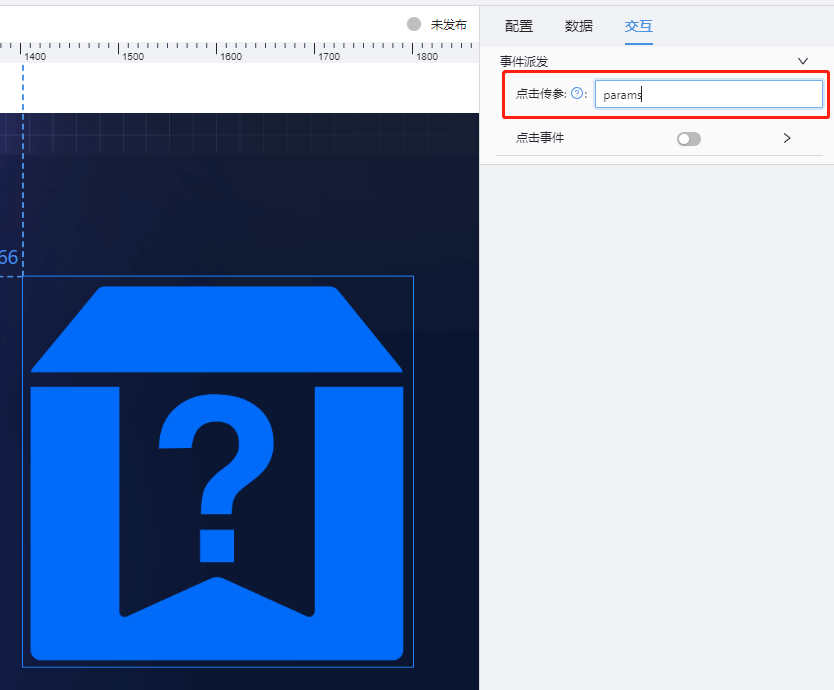

# 单张图片(single-image) 组件

## 简述

-   用于对平台默认图片素材及素材中心图片文件的使用.
-   支持的文件类型:**[.png,.jpg,.jpeg,.gif,.svg]**
-   对于 svg 类型文件,目前的仅支持纯色 svg 文件.
-   支持点击参数派发
-   支持点击后的弹框/抽屉事件配置

## 上述特殊情况说明

对于单张图片组件,支持对外派发参数,派发的参数名称的配置,与其他组件一致，派发的参数值,也支持页面配置.

```js
如果点击图片后,需要派发出的参数为:
{params:1}
```

则配置如下  

## 组件逻辑

该组件将图片文件,作为组件背景图渲染,从而实现对图片的应用

## 配置项

## 基础配置

-   位图及矢量图(svg)的选择
-   图片重复属性的配置
-   是否显示手势光标的配置

### 数据

图片组件的数据,目前不建议配置.

### 交互

支持设置点击图片后事件及点击后参数的配置点击传参和点击事件(弹窗 or 抽屉)原则上是互斥的.

## 更新说明

2022-7-30,更新了对素材中心的应用,对接素材中心 2.0 版本. 需要编辑器的集中配置 **materialConfig** 节点中,存在如下配置：

```json
"describe3": "素材中心根级分组ID,本地环境为74,数据来自  TAW_RESOURCE_GROUP.id,无特殊要求,可不做修改",
"materialRootGroupId": 74,

```
