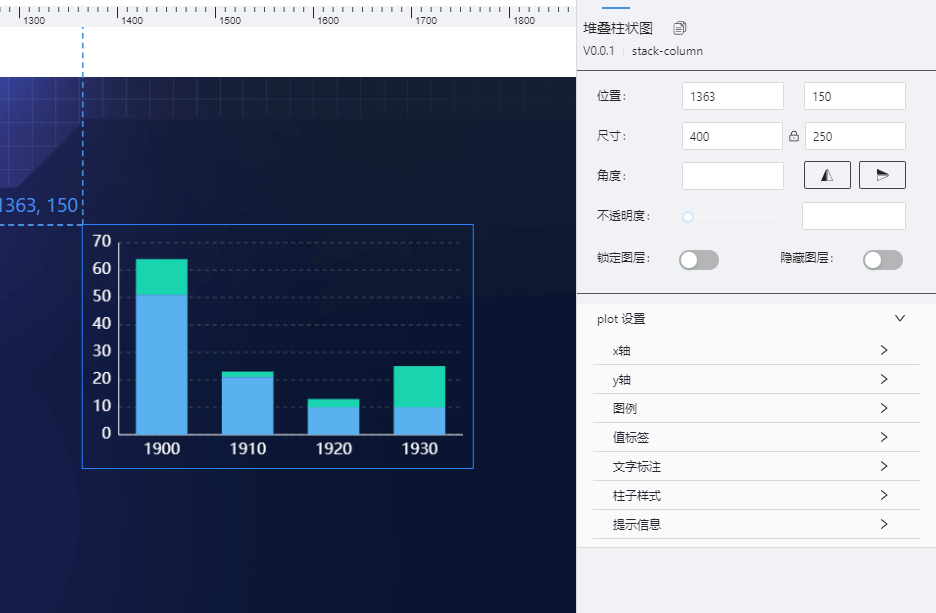
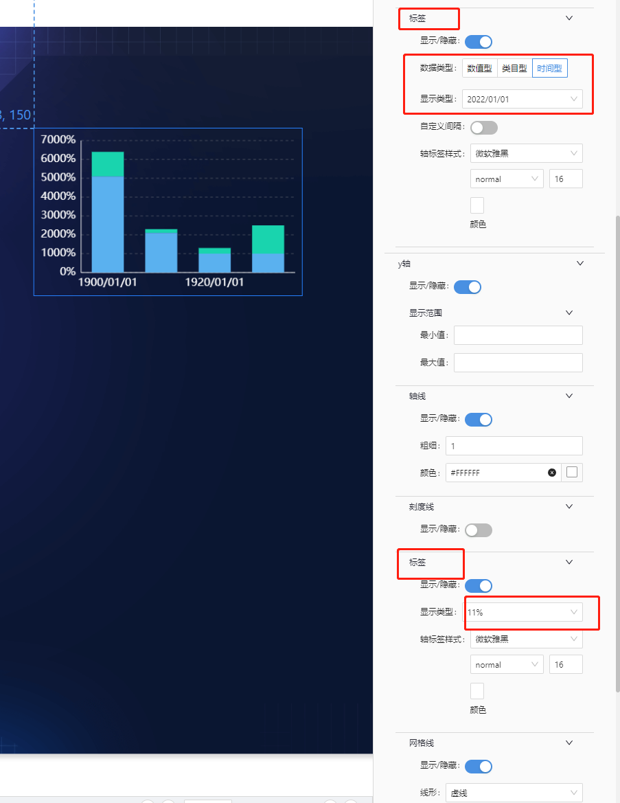
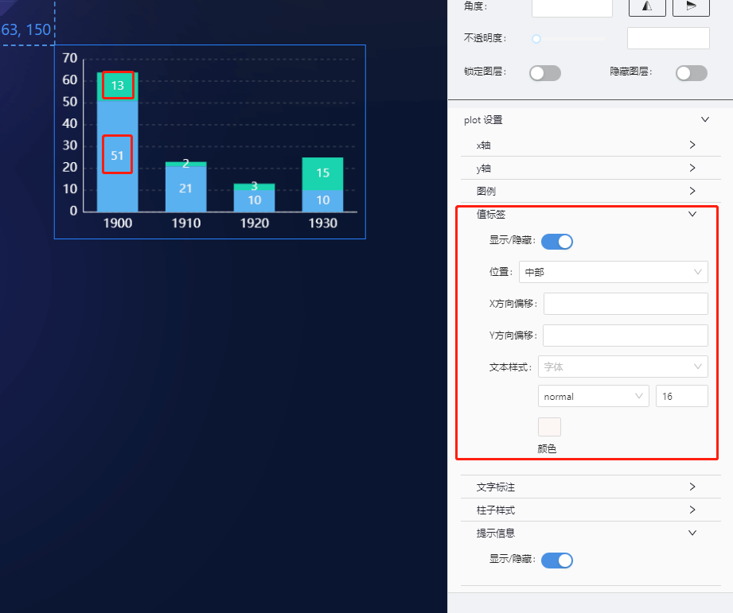
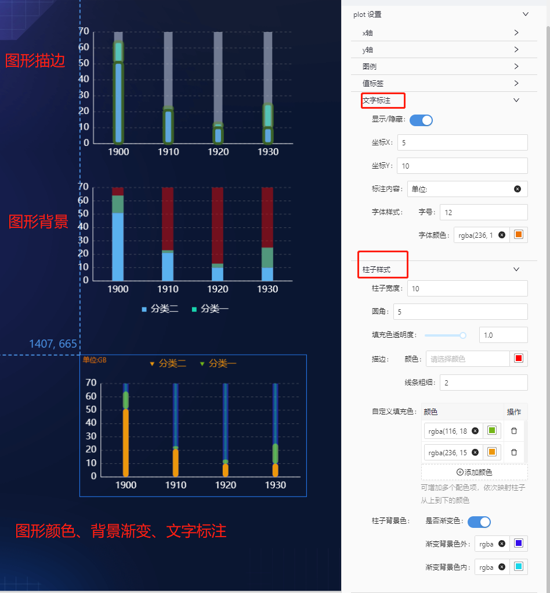
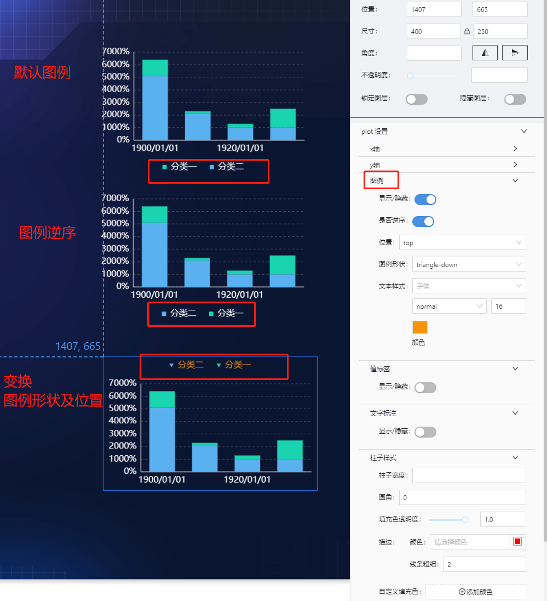
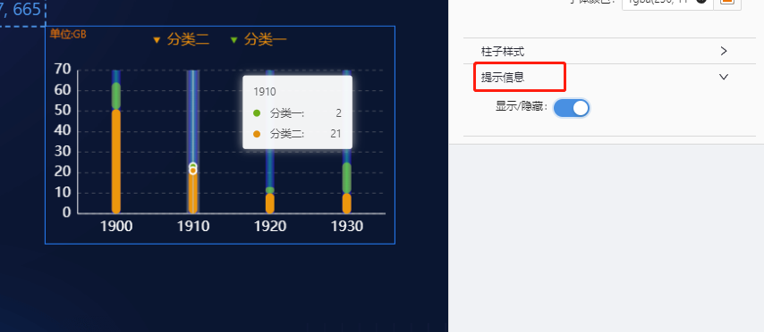
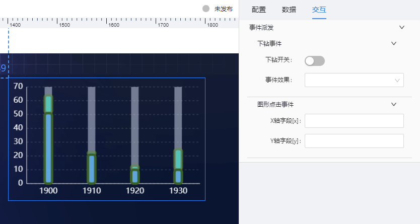

# 基础柱状图(stack-column) 组件

## 简述

堆叠柱状图是柱状图的一种，支持 X 轴、Y 轴、图表系列、图例、提示信息等配置，能够在较小的空间内展示多维数据差异，在可视化应用中，使用频率较高。

## 支持的呈现形式

### 基础堆叠柱形图



### 坐标轴格式化



### 值标签设置



### 柱子设置



### 图例配置



### 悬浮提示设置



## 组件逻辑

通过自研的图表组件实现.

## 配置项

## 基础配置

-   坐标轴设置(轴线/刻度线/网格线/轴标签)
-   值标签设置
-   图例设置
-   柱图图样式设置(支持渐变色)
-   悬浮提示设置

### 数据

```json
[
    {
        "y": 13, //X轴数据
        "x": "1900", //Y轴数据
        "s": "分类一", // 分类数据,也是图例数据
        "u": "GB" // 数据单位,也是 [文字标注]后的数据
    },
    {
        "y": 2,
        "x": "1910",
        "s": "分类一",
        "u": "GB"
    },
    {
        "y": 3,
        "x": "1920",
        "s": "分类一",
        "u": "GB"
    }
]
```

### 交互

支持点击图形下钻及事件派发



-   支持点击图形展示弹框或抽屉
-   支持点击图形时,向外派发数值
-   参数派发及事件派发互斥

    ```js
       示例配置:
       X轴字段[x] : paramX
       Y轴字段[y] : paramY

       数示例数据:
      [
        {
            "y": 2,
            "x": "1910",
            "s": "分类一",
            "u": "GB"
        },
        {
            "y": 3,
            "x": "1920",
            "s": "分类一",
            "u": "GB"
        },
      ]
      则点击一个柱形图,对外派发的参数为:
      {paramX:"1910",paramY:2}

    ```

## 更新说明
