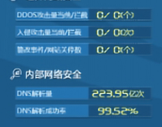

# stats-indi-group 组件

## 简述

用于复杂指标的展示形式，如果是简单的指标展示，如几行几列中每个指标的样式统一， `stats-indi`组件即可满足，如果有其他特殊情况使用该组件。（stats-indi 更新也兼容了这种情况）

## 上述特殊情况说明

如图：每行中的每个数据都可以认为是一个指标展示，只是有的隐藏了 label，有的上下顺序颠倒，在竖直方向上看每一行是相同的。这里就需要自定义每个指标的样式。<br /><br /> 

## 组件逻辑

该组件设想的最特殊的情况是横向排列加竖向排列组成一个矩阵展示（即数据是二维数组），竖向中就是简单的将横向数据遍历展示。

所以在本组件中支持设置单行有多个指标展示（即 stats-indi 元组件），添加多个后就需要对每一个单独设置样式（翻牌器样式、stats-indi 样式）。竖向上只需要设置排列方式，可选有文档流模式（即自然排列，溢出后出现滚动条）、flex 弹性盒模式（采用 flex 布局排列）。

## 配置项

## 基础配置

-   分项设置单个指标展示的样式
-   横向上支持设置布局模式、单行高度、背景图
-   竖向上文档流模式支持设置间距，弹性盒模式支持设置 flex 的布局模式

### 数据

因为想要的数据是二维数组，但是目前的 dataModel.json 还不支持二维数组的配置方式，所以简化为一维数组，通过逻辑再转换为二维数组。一维数组每一项就包括了单行中的所有数据，每个指标的数据格式是一个 object：

```js
{
    id: 'xxx',
    name:'xxx',
    value:'xxx',
    value:'xxx',
    unit: 'xxx',
    icon: 'xxx',
}
```

所以就需要数组每一项的值能够支持逻辑分类后生成目标二维数组，所以采用了在每个 key 后添加`_number`，number 就表明是单行指标中的第几个，代码中处理逻辑是根据后缀的数字分类生成最终的二维数组结构。转换前后如下:

```js
[
    // 一行数据
    {
        id_1: '',
        name_1: '',
        value_1: '',

        id_2: '',
        name_2: '',
        value_2: '',
    },
];
// 转换结果为:
[
    // 一行数据
    [
        {
            id: '',
            name: '',
            value: '',
        },
        {
            id: '',
            name: '',
            value: '',
        },
    ],
];
```

_如果以后 dataModel 支持了二维数组形式，也就是接口返回的就是二维数据，那么只要代码中的转换逻辑去掉即可_

### 交互

支持设置点击每个指标项后的事件（弹窗或抛出值）

## update

-   每行每列中指标样式一致，分项设置中只设置一项时，就当作其他项都使用同一套配置。即覆盖了 stats-indi 的功能。如果设置多于一项，则还是一项配置对应一个指标展示。

-   福建更新

    下图中一行的数据多个指标合并成了这种形式 : `a.name/b.name a.value/b.value`,这种情况其实也可以认为是单行中的指标聚合展示的结果。所以通过一个开关支持了这种形式。在横向上设置聚合开关和聚合后每一项之间的分隔符。当打开聚合展示时，指标展示样式默认只采用分项设置中的第一项，多余项的设置不起作用。<br /><br /> 
