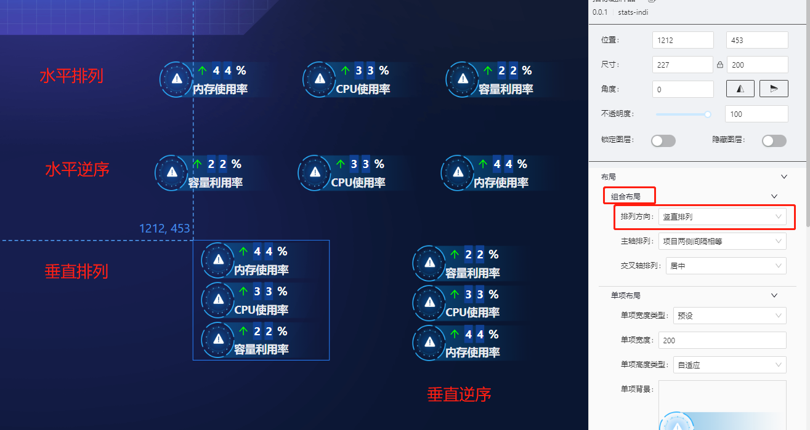
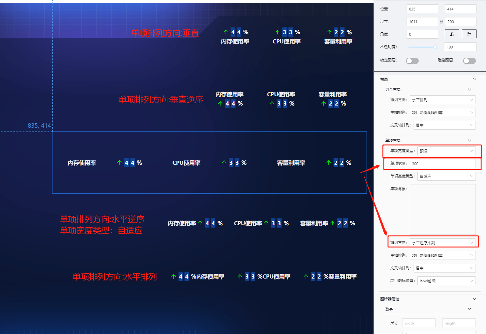
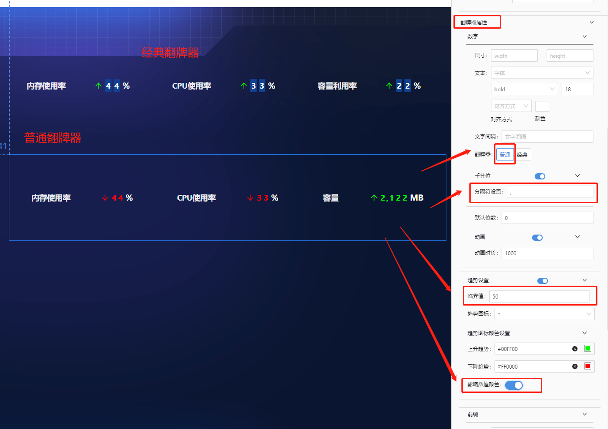
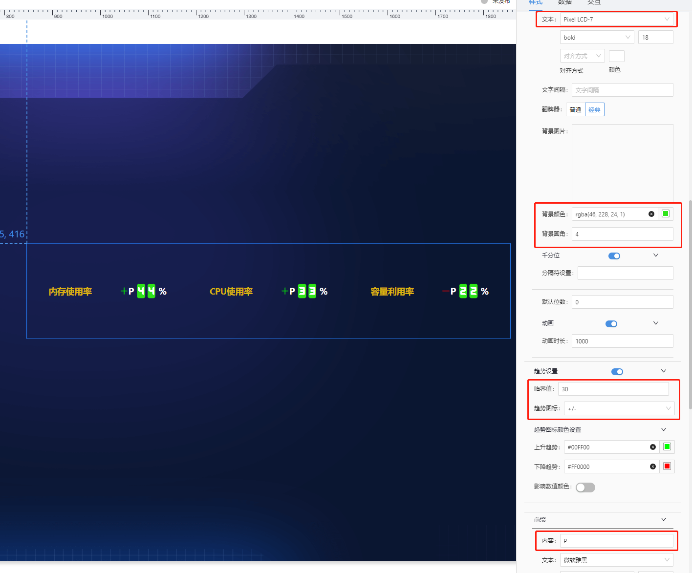
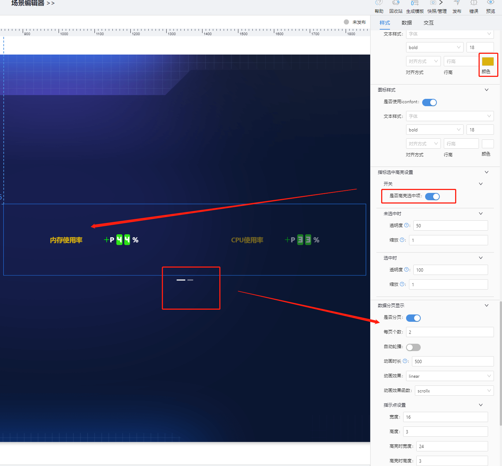
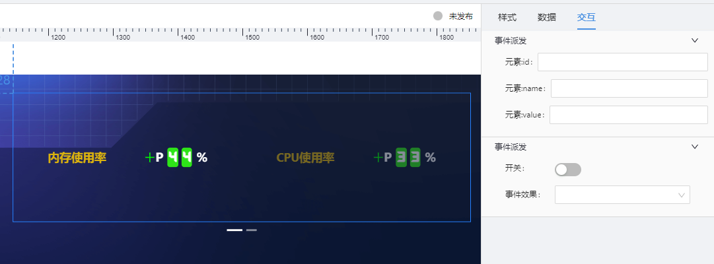

# 指标翻牌器(stats-indi) 组件

## 简述

-   用于展示单个或成组的指标
-   支持指标的分页展示
-   支持指标的名称/数值/单位/趋势/前缀配置
-   支持点击高亮配置
-   支持指标背景配置

## 支持的呈现形式

### 组合排列



### 单项布局



###翻牌器内容设置







## 配置项

## 基础配置

-   默认选中
-   轮播配置
-   常规元素配置(元素设置)
-   选中(高亮)元素设置

### 数据

```json
[
    {
        "id": "1", //指标ID,主要作为点击传参使用
        "name": "内存使用率", //指标名称
        "value": 43.59, //指标值
        "unit": "%", //指标单位
        "icon": "", //指标展示的图标,一般为icon图标名
        "render": 0, //级别
    },
    {
        "id": "2",
        "name": "CPU使用率",
        "value": 32.93,
        "unit": "%",
        "icon": ""，
        "render": 1,
    },
    {
        "id": "3",
        "name": "容量利用率",
        "value": 21.8,
        "unit": "%",
        "icon": ""，
        "render": 2,
    }
]
```

### 交互

-   支持点击图形展示弹框或抽屉
-   支持点击图形时,向外派发数值
-   参数派发及事件派发互斥



可派发的值,是根据数据而定的,我们举例数据如下:

```json
[
    {
        "id": "3",
        "name": "容量利用率",
        "value": 21.8,
        "unit": "%",
        "icon": ""
    }
]
```

    ```js
       示例配置:
      元素:id : paramId
      元素:name: paramName
      元素:value:paramValue

      则点击[容量利用率]指标组,对外派发的参数为:
      {paramId:"3",paramName:"容量利用率",paramValue:21.8}

    ```

## 更新说明

-   陕西更新

    新增趋势配置中的根据级别渲染颜色配置，根据级别字段 render 决定显示颜色
