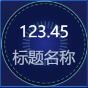
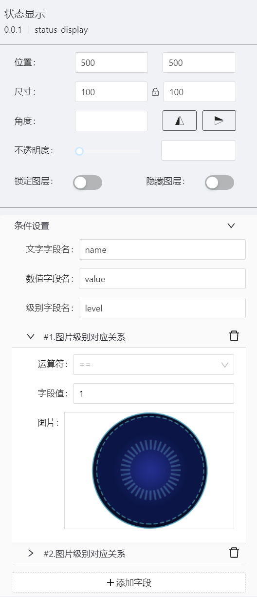
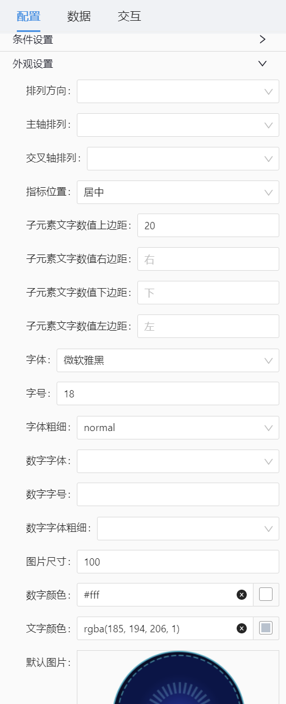
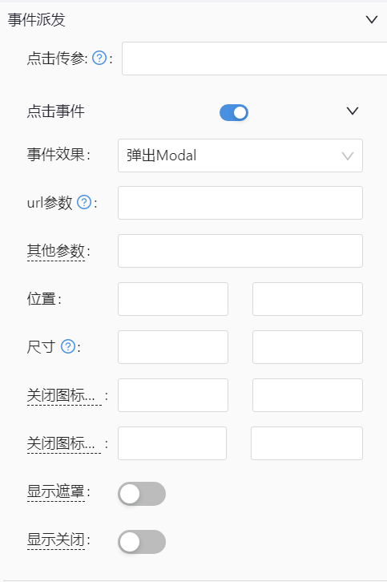

# 状态显示(status-display) 组件

## 简述

-   根据级别切换显示图片
-   支持不同级别背景图设置
-   支持文字、数值显示
-   支持点击参数派发
-   支持点击后的弹框/抽屉事件配置

## 支持的呈现形式









## 基础配置

-   默认选中
-   轮播配置
-   常规元素配置(元素设置)
-   选中(高亮)元素设置

### 数据

```json
[
    {
        "id": 1, //id唯一标识
        "name": "标题名称",
        "value": 123.45,
        "level": 1 //level与条件设置中级别对应显示不同的图片
    }
]
```

### 事件派发

点击传参，可派发的值为数据中的 id 字段:

```json
[
    {
        "id": 1, //id唯一标识
        "name": "标题名称",
        "value": 123.45,
        "level": 1 //level与条件设置中级别对应显示不同的图片
    }
]
```

#### 事件派发点击后的弹框/抽屉

点击传参，根据数据中字段配置获取对应参数:

```json
[
    {
        "id": 1, //id唯一标识
        "name": "标题名称",
        "value": 123.45,
        "level": 1 //level与条件设置中级别对应显示不同的图片
    }
]
```
