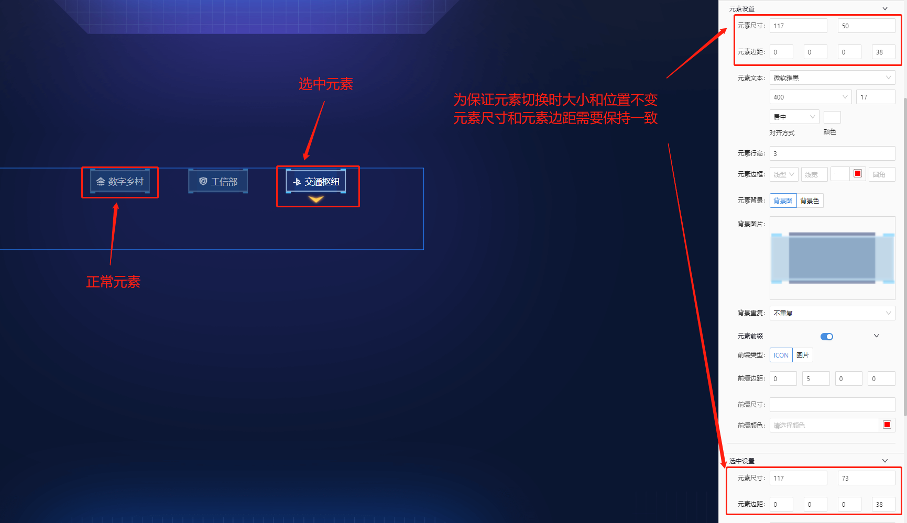
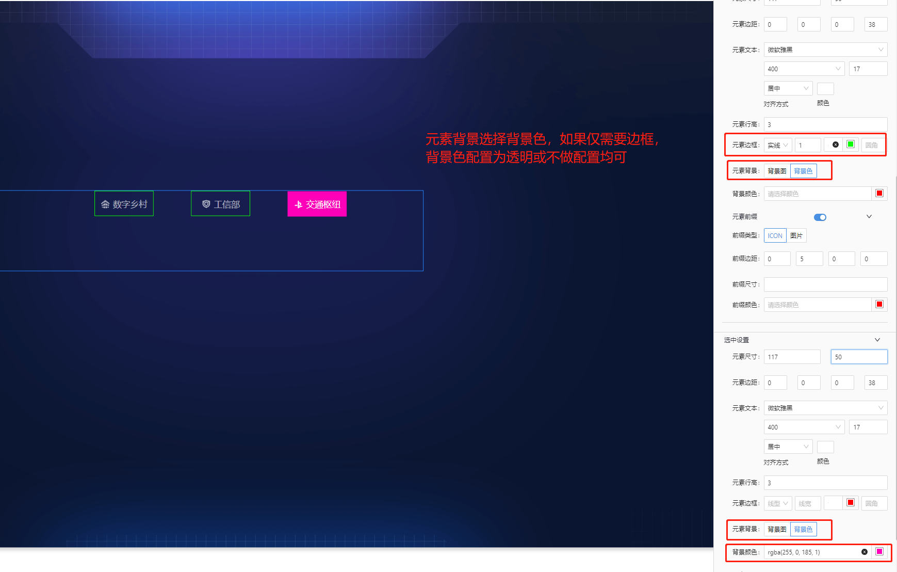
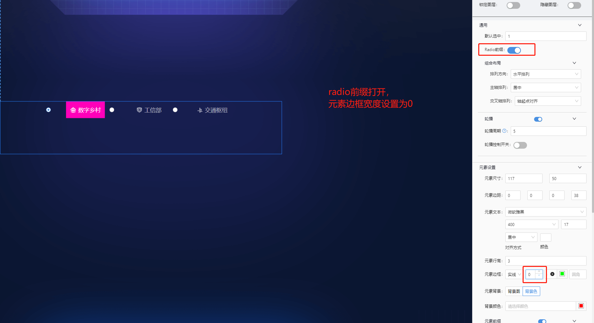
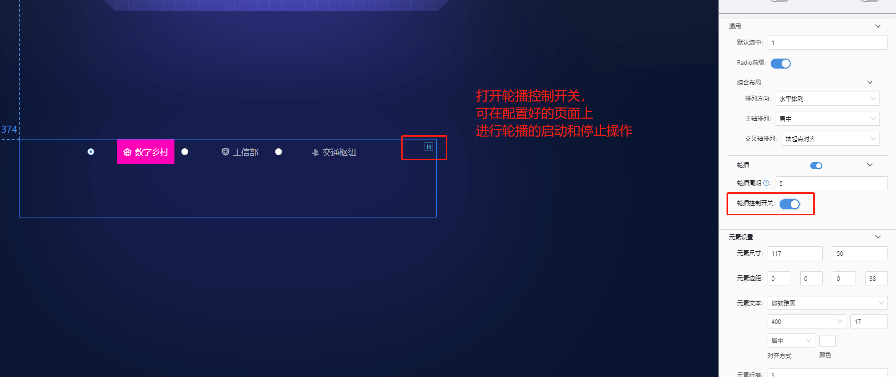
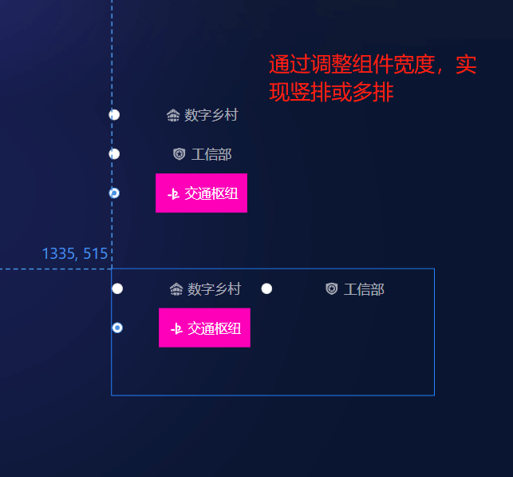
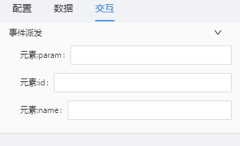

# TAB 列表(tab-list) 组件

## 简述

-   用于实现 tab 标签类型页面元素
-   支持 Tab 元素的背景图设置
-   支持 tab 元素的轮播及轮播启停控制
-   支持默认选中项设置
-   支持点击参数派发
-   不支持点击后的弹框/抽屉事件配置

## 支持的呈现形式

### 带背景图的 tab



### 纯色 tab



### radio 类型 tab



### tab 轮播控制



### 竖排及多排 tab



## 组件逻辑

轮播控制通过定时器实现

## 配置项

## 基础配置

-   默认选中
-   轮播配置
-   常规元素配置(元素设置)
-   选中(高亮)元素设置

### 数据

```json
[
    {
        "id": "1", // id,作为组件的唯一标识，当前数据内不可重复
        "content": "数字乡村", //tab展示的名称
        "icon": "visual-manager-logo-shuzixiangcun" // 图标名称，一般对应iconfont 中的图标名
    },
    {
        "id": "2",
        "content": "工信部",
        "icon": "visual-manager-gongxinbu"
    },
    {
        "id": "3",
        "content": "交通枢纽",
        "icon": "visual-manager-jiaotongshuniu"
    }
]
```

### 交互

目前开放的配置项有三个 

可派发的值,是根据数据而定的,我们举例数据如下:

```json
[
    {
        "id": "3",
        "content": "交通枢纽",
        "icon": "visual-manager-jiaotongshuniu"
    }
]
```

#### 元素:parms

```js
后方输入框中，需要输入数据的 key 值.
即当前配置可以为 id/content/icon中的一个,
点击后派发的值为: {id:3} /{content: "交通枢纽"}/ {icon: "visual-manager-jiaotongshuniu"}
```

#### 元素 ID

```js
当前配置可以为任一名称,保证全局唯一即可,示例配置: paramsId
点击后派发的值为: {paramsId:1}
```

#### 元素 name

```js
当前配置可以为任一名称,保证全局唯一即可,示例配置: paramsName
点击后派发的值为: {paramsName:"交通枢纽"}
```

## 更新说明
