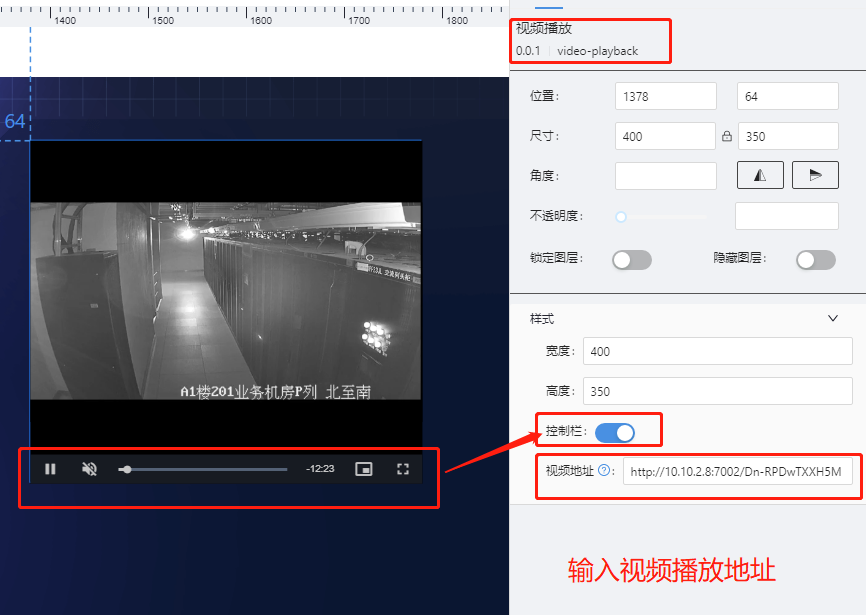
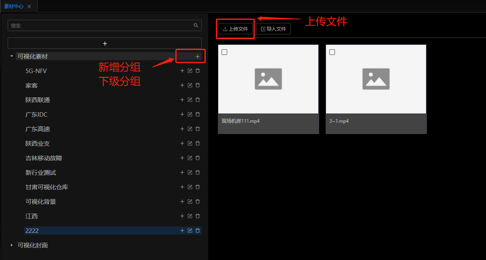
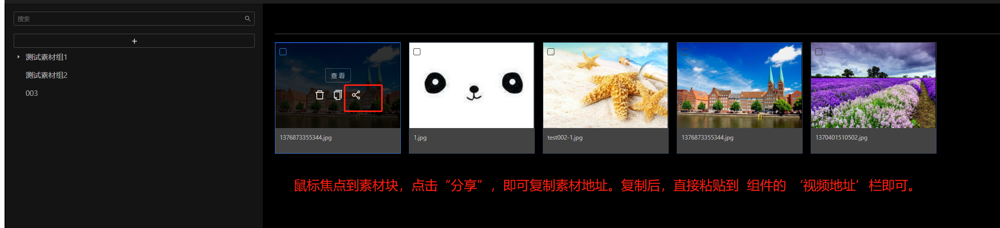

# 视频播放(video-playback) 组件

## 简述

视频播放组件,支持 视频格式 **m3u8/ mp4/ rtmp/flv**

## 支持的呈现形式

## 配置项

### 基础配置

-   支持视频地址配置
-   支持控制栏的显隐配置
-   支持组件的高/宽设定

### 特殊说明

-   支持的视频地址样例

    1. http://10.10.2.8:7002/Dn-RPDwTXXH5MTnfI7Hal.mp4
    2. https://bitdash-a.akamaihd.net/content/sintel/hls/playlist.m3u8
    3. rtmp://ns8.indexforce.com/home/mystream

-   本组件不支持选择机器磁盘文件播放,即在视频地址部分,不可输入例如 **D://doc/xxx.mp4** ,如果需要播放自有的视频文件,需要先将文件上传到与可视化平台配套的素材中心.

### 数据

不支持数据配置.

### 交互

组件不支持交互

## 更新说明

时间:2022-8-24

-   播放异常修复.
-   MP4 格式文件支持
